# Birzeit University Insurance System - PlantUML Diagrams

## 1. Use Case Diagram

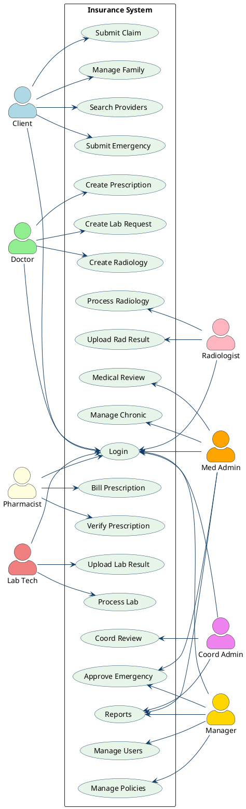

---

## 2. Entity Relationship Diagram (ER Diagram)

```plantuml
@startuml ER_Diagram
!define TABLE(x) class x << (T,#FFAAAA) >>
!define PRIMARY_KEY(x) <u>x</u>
!define FOREIGN_KEY(x) <i>x</i>

skinparam class {
    BackgroundColor White
    BorderColor #0D3B66
    ArrowColor #0D3B66
}

TABLE(clients) {
    PRIMARY_KEY(id) : UUID
    --
    password_hash : VARCHAR(255)
    full_name : VARCHAR(150)
    email : VARCHAR(150) <<unique>>
    phone : VARCHAR(40)
    employee_id : VARCHAR(50) <<unique>>
    national_id : VARCHAR(20) <<unique>>
    department : VARCHAR(150)
    faculty : VARCHAR(150)
    specialization : VARCHAR(150)
    clinic_location : VARCHAR(200)
    pharmacy_code : VARCHAR(50)
    pharmacy_name : VARCHAR(150)
    lab_code : VARCHAR(50)
    lab_name : VARCHAR(150)
    radiology_code : VARCHAR(50)
    radiology_name : VARCHAR(150)
    date_of_birth : DATE
    gender : VARCHAR(10)
    status : ENUM(MemberStatus)
    requested_role : ENUM(RoleName)
    role_request_status : ENUM(RoleRequestStatus)
    email_verified : BOOLEAN
    FOREIGN_KEY(policy_id) : UUID
    created_at : TIMESTAMP
    updated_at : TIMESTAMP
}

TABLE(roles) {
    PRIMARY_KEY(id) : UUID
    --
    name : ENUM(RoleName)
    note right: INSURANCE_CLIENT, DOCTOR,
    note right: PHARMACIST, LAB_TECH, RADIOLOGIST,
    note right: INSURANCE_MANAGER, MEDICAL_ADMIN,
    note right: COORDINATION_ADMIN
    description : TEXT
}

TABLE(client_roles) {
    FOREIGN_KEY(client_id) : UUID
    FOREIGN_KEY(role_id) : UUID
}

TABLE(policies) {
    PRIMARY_KEY(id) : UUID
    --
    policy_no : VARCHAR(50) <<unique>>
    name : VARCHAR(120)
    description : TEXT
    start_date : DATE
    end_date : DATE
    status : ENUM(PolicyStatus)
    note right: ACTIVE, EXPIRED, CANCELLED
    coverage_limit : DECIMAL(12,2)
    deductible : DECIMAL(12,2)
    emergency_rules : TEXT
    created_at : TIMESTAMP
    updated_at : TIMESTAMP
}

TABLE(coverages) {
    PRIMARY_KEY(id) : UUID
    --
    FOREIGN_KEY(policy_id) : UUID
    coverage_type : ENUM(CoverageType)
    note right: OUTPATIENT, INPATIENT,
    note right: EMERGENCY, SURGERY
    percentage : DECIMAL(5,2)
    max_amount : DECIMAL(12,2)
    description : TEXT
}

TABLE(healthcare_provider_claims) {
    PRIMARY_KEY(id) : UUID
    --
    FOREIGN_KEY(provider_id) : UUID
    FOREIGN_KEY(client_id) : UUID
    FOREIGN_KEY(policy_id) : UUID
    client_name : VARCHAR(150)
    description : TEXT
    diagnosis : TEXT
    treatment_details : TEXT
    amount : DECIMAL(12,2)
    service_date : DATE
    status : ENUM(ClaimStatus)
    note right: PENDING_MEDICAL,
    note right: AWAITING_COORDINATION_REVIEW,
    note right: APPROVED_FINAL, REJECTED_FINAL,
    note right: RETURNED_FOR_REVIEW
    provider_role : VARCHAR(50)
    invoice_image_path : VARCHAR(500)
    rejection_reason : TEXT
    is_covered : BOOLEAN
    insurance_covered_amount : DECIMAL(12,2)
    client_pay_amount : DECIMAL(12,2)
    FOREIGN_KEY(medical_reviewer_id) : UUID
    FOREIGN_KEY(coordination_reviewer_id) : UUID
    submitted_at : TIMESTAMP
    medical_reviewed_at : TIMESTAMP
    coordination_reviewed_at : TIMESTAMP
}

TABLE(prescriptions) {
    PRIMARY_KEY(id) : UUID
    --
    FOREIGN_KEY(doctor_id) : UUID
    FOREIGN_KEY(member_id) : UUID
    FOREIGN_KEY(pharmacist_id) : UUID
    status : ENUM(PrescriptionStatus)
    note right: PENDING, VERIFIED,
    note right: BILLED, REJECTED
    medicine : VARCHAR(200)
    dosage : VARCHAR(100)
    instructions : TEXT
    total_price : DECIMAL(12,2)
    is_chronic : BOOLEAN
    rejection_reason : TEXT
    created_at : TIMESTAMP
    updated_at : TIMESTAMP
}

TABLE(lab_requests) {
    PRIMARY_KEY(id) : UUID
    --
    FOREIGN_KEY(doctor_id) : UUID
    FOREIGN_KEY(member_id) : UUID
    FOREIGN_KEY(lab_tech_id) : UUID
    test_name : VARCHAR(200)
    notes : TEXT
    result_url : VARCHAR(500)
    status : ENUM(LabRequestStatus)
    note right: PENDING, IN_PROGRESS,
    note right: COMPLETED, REJECTED
    entered_price : DECIMAL(10,2)
    approved_price : DECIMAL(10,2)
    created_at : TIMESTAMP
    updated_at : TIMESTAMP
}

TABLE(radiology_requests) {
    PRIMARY_KEY(id) : UUID
    --
    FOREIGN_KEY(doctor_id) : UUID
    FOREIGN_KEY(member_id) : UUID
    FOREIGN_KEY(radiologist_id) : UUID
    scan_type : VARCHAR(200)
    notes : TEXT
    result_url : VARCHAR(500)
    status : ENUM(RadiologyRequestStatus)
    note right: PENDING, IN_PROGRESS,
    note right: COMPLETED, REJECTED
    entered_price : DECIMAL(10,2)
    approved_price : DECIMAL(10,2)
    created_at : TIMESTAMP
    updated_at : TIMESTAMP
}

TABLE(emergency_requests) {
    PRIMARY_KEY(id) : UUID
    --
    FOREIGN_KEY(client_id) : UUID
    FOREIGN_KEY(doctor_id) : UUID
    FOREIGN_KEY(reviewed_by) : UUID
    description : TEXT
    location : VARCHAR(500)
    contact_phone : VARCHAR(40)
    status : ENUM(EmergencyStatus)
    note right: PENDING_MEDICAL,
    note right: APPROVED_BY_MEDICAL,
    note right: REJECTED_BY_MEDICAL
    rejection_reason : TEXT
    created_at : TIMESTAMP
    reviewed_at : TIMESTAMP
}

TABLE(family_members) {
    PRIMARY_KEY(id) : UUID
    --
    FOREIGN_KEY(client_id) : UUID
    full_name : VARCHAR(150)
    national_id : VARCHAR(20) <<unique>>
    insurance_number : VARCHAR(30) <<unique>>
    relation : ENUM(FamilyRelation)
    gender : ENUM(Gender)
    date_of_birth : DATE
    status : ENUM(ProfileStatus)
    note right: PENDING, APPROVED, REJECTED
    rejection_reason : TEXT
    created_at : TIMESTAMP
}

TABLE(search_profiles) {
    PRIMARY_KEY(id) : UUID
    --
    FOREIGN_KEY(owner_id) : UUID
    profile_type : ENUM(ProviderType)
    note right: DOCTOR, PHARMACY,
    note right: LAB, RADIOLOGY
    name : VARCHAR(150)
    specialization : VARCHAR(150)
    location_lat : DECIMAL(10,8)
    location_lng : DECIMAL(11,8)
    address : VARCHAR(500)
    phone : VARCHAR(40)
    working_hours : VARCHAR(200)
    document_path : VARCHAR(500)
    status : ENUM(ProfileStatus)
    created_at : TIMESTAMP
}

TABLE(notifications) {
    PRIMARY_KEY(id) : UUID
    --
    FOREIGN_KEY(recipient_id) : UUID
    title : VARCHAR(200)
    message : TEXT
    type : ENUM(NotificationType)
    is_read : BOOLEAN
    created_at : TIMESTAMP
}

TABLE(price_list) {
    PRIMARY_KEY(id) : UUID
    --
    service_type : ENUM(ServiceType)
    note right: LAB, PHARMACY, RADIOLOGY
    service_name : VARCHAR(200)
    union_price : DECIMAL(10,2)
    description : TEXT
    is_active : BOOLEAN
    created_at : TIMESTAMP
}

TABLE(chronic_patient_schedules) {
    PRIMARY_KEY(id) : UUID
    --
    FOREIGN_KEY(client_id) : UUID
    disease : ENUM(ChronicDisease)
    next_visit_date : DATE
    last_prescription_date : DATE
    notes : TEXT
}

TABLE(medical_records) {
    PRIMARY_KEY(id) : UUID
    --
    FOREIGN_KEY(member_id) : UUID
    FOREIGN_KEY(doctor_id) : UUID
    diagnosis : TEXT
    treatment : TEXT
    notes : TEXT
    created_at : TIMESTAMP
    updated_at : TIMESTAMP
}

' Relationships
clients ||--o{ client_roles
roles ||--o{ client_roles
policies ||--o{ clients
policies ||--o{ coverages
clients ||--o{ healthcare_provider_claims : "as provider"
clients ||--o{ healthcare_provider_claims : "as client"
clients ||--o{ prescriptions : "as doctor"
clients ||--o{ prescriptions : "as member"
clients ||--o{ prescriptions : "as pharmacist"
clients ||--o{ lab_requests : "as doctor"
clients ||--o{ lab_requests : "as member"
clients ||--o{ lab_requests : "as lab_tech"
clients ||--o{ radiology_requests : "as doctor"
clients ||--o{ radiology_requests : "as member"
clients ||--o{ radiology_requests : "as radiologist"
clients ||--o{ emergency_requests : "as client"
clients ||--o{ emergency_requests : "as doctor"
clients ||--o{ family_members
clients ||--o{ search_profiles
clients ||--o{ notifications
clients ||--o{ chronic_patient_schedules
clients ||--o{ medical_records
policies ||--o{ healthcare_provider_claims

@enduml
```

---

## 3. Class Diagram

```plantuml
@startuml Class_Diagram
skinparam class {
    BackgroundColor #FEFEFE
    BorderColor #0D3B66
    ArrowColor #0D3B66
}

package "Entity Layer" {

    class Client {
        -id: UUID
        -passwordHash: String
        -fullName: String
        -email: String
        -phone: String
        -employeeId: String
        -nationalId: String
        -department: String
        -faculty: String
        -dateOfBirth: LocalDate
        -gender: String
        -status: MemberStatus
        -emailVerified: boolean
        -createdAt: Instant
        -updatedAt: Instant
        +hasRole(roleName: RoleName): boolean
    }

    class Role {
        -id: UUID
        -name: RoleName
        -description: String
    }

    class Policy {
        -id: UUID
        -policyNo: String
        -name: String
        -description: String
        -startDate: LocalDate
        -endDate: LocalDate
        -status: PolicyStatus
        -coverageLimit: BigDecimal
        -deductible: BigDecimal
    }

    class Coverage {
        -id: UUID
        -coverageType: CoverageType
        -percentage: BigDecimal
        -maxAmount: BigDecimal
    }

    class HealthcareProviderClaim {
        -id: UUID
        -description: String
        -diagnosis: String
        -amount: Double
        -serviceDate: LocalDate
        -status: ClaimStatus
        -providerRole: String
        -rejectionReason: String
        -insuranceCoveredAmount: BigDecimal
        -clientPayAmount: BigDecimal
        -submittedAt: Instant
    }

    class Prescription {
        -id: UUID
        -medicine: String
        -dosage: String
        -instructions: String
        -status: PrescriptionStatus
        -totalPrice: Double
        -isChronic: Boolean
        -createdAt: Instant
    }

    class LabRequest {
        -id: UUID
        -testName: String
        -notes: String
        -resultUrl: String
        -status: LabRequestStatus
        -enteredPrice: Double
        -approvedPrice: Double
    }

    class RadiologyRequest {
        -id: UUID
        -scanType: String
        -notes: String
        -resultUrl: String
        -status: LabRequestStatus
        -enteredPrice: Double
        -approvedPrice: Double
    }

    class EmergencyRequest {
        -id: UUID
        -description: String
        -location: String
        -contactPhone: String
        -status: EmergencyStatus
        -rejectionReason: String
        -createdAt: Instant
    }

    class FamilyMember {
        -id: UUID
        -fullName: String
        -nationalId: String
        -insuranceNumber: String
        -relation: FamilyRelation
        -gender: Gender
        -dateOfBirth: LocalDate
        -status: ProfileStatus
    }

    class SearchProfile {
        -id: UUID
        -profileType: ProviderType
        -name: String
        -locationLat: BigDecimal
        -locationLng: BigDecimal
        -address: String
        -phone: String
        -status: ProfileStatus
    }

    class MedicalRecord {
        -id: UUID
        -diagnosis: String
        -treatment: String
        -notes: String
        -createdAt: Instant
    }

    class Notification {
        -id: UUID
        -title: String
        -message: String
        -type: NotificationType
        -isRead: boolean
        -createdAt: Instant
    }

    class PriceList {
        -id: UUID
        -serviceType: String
        -serviceName: String
        -unionPrice: BigDecimal
        -isActive: boolean
    }

    class ChronicPatientSchedule {
        -id: UUID
        -disease: ChronicDisease
        -nextVisitDate: LocalDate
        -lastPrescriptionDate: LocalDate
        -notes: String
    }
}

package "Enums" {
    enum RoleName {
        INSURANCE_CLIENT
        DOCTOR
        PHARMACIST
        LAB_TECH
        RADIOLOGIST
        INSURANCE_MANAGER
        MEDICAL_ADMIN
        COORDINATION_ADMIN
    }

    enum ClaimStatus {
        PENDING_MEDICAL
        AWAITING_COORDINATION_REVIEW
        APPROVED_FINAL
        REJECTED_FINAL
        RETURNED_FOR_REVIEW
    }

    enum PrescriptionStatus {
        PENDING
        VERIFIED
        BILLED
        REJECTED
    }

    enum LabRequestStatus {
        PENDING
        IN_PROGRESS
        COMPLETED
        REJECTED
    }

    enum EmergencyStatus {
        PENDING_MEDICAL
        APPROVED_BY_MEDICAL
        REJECTED_BY_MEDICAL
    }

    enum MemberStatus {
        ACTIVE
        INACTIVE
        SUSPENDED
    }

    enum ProfileStatus {
        PENDING
        APPROVED
        REJECTED
    }
}

' Relationships
Client "1" -- "*" Role : has >
Client "*" -- "1" Policy : belongs to >
Policy "1" -- "*" Coverage : defines >
Client "1" -- "*" HealthcareProviderClaim : submits >
Client "1" -- "*" Prescription : creates/receives >
Client "1" -- "*" LabRequest : creates/processes >
Client "1" -- "*" RadiologyRequest : creates/processes >
Client "1" -- "*" EmergencyRequest : submits >
Client "1" -- "*" FamilyMember : has >
Client "1" -- "*" SearchProfile : owns >
Client "1" -- "*" Notification : receives >
Client "1" -- "*" MedicalRecord : has >
Client "1" -- "*" ChronicPatientSchedule : has >
PriceList "1" -- "*" LabRequest : prices >
PriceList "1" -- "*" RadiologyRequest : prices >

@enduml
```

---

## 4. Sequence Diagram - Claims Workflow

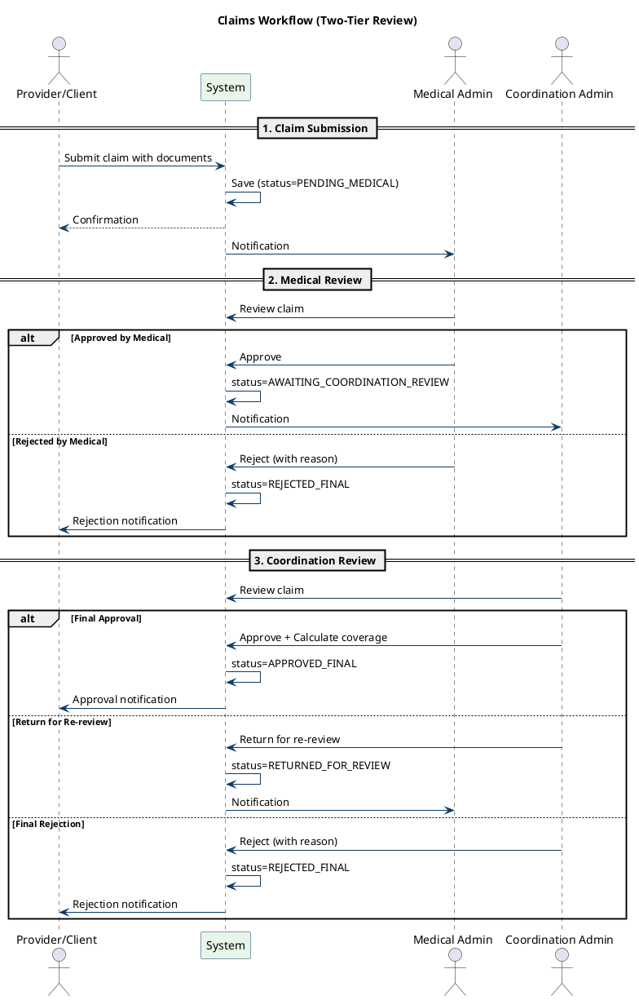

---

## 5. Sequence Diagram - Prescription Workflow

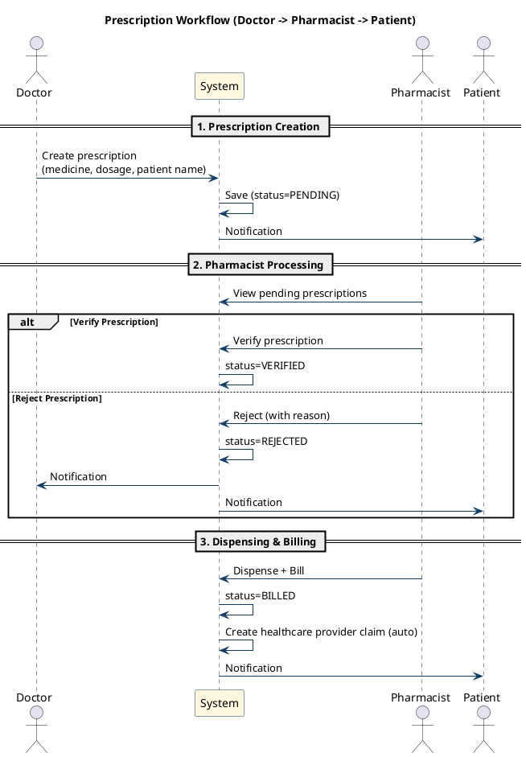

---

## 6. Sequence Diagram - Lab Request Workflow

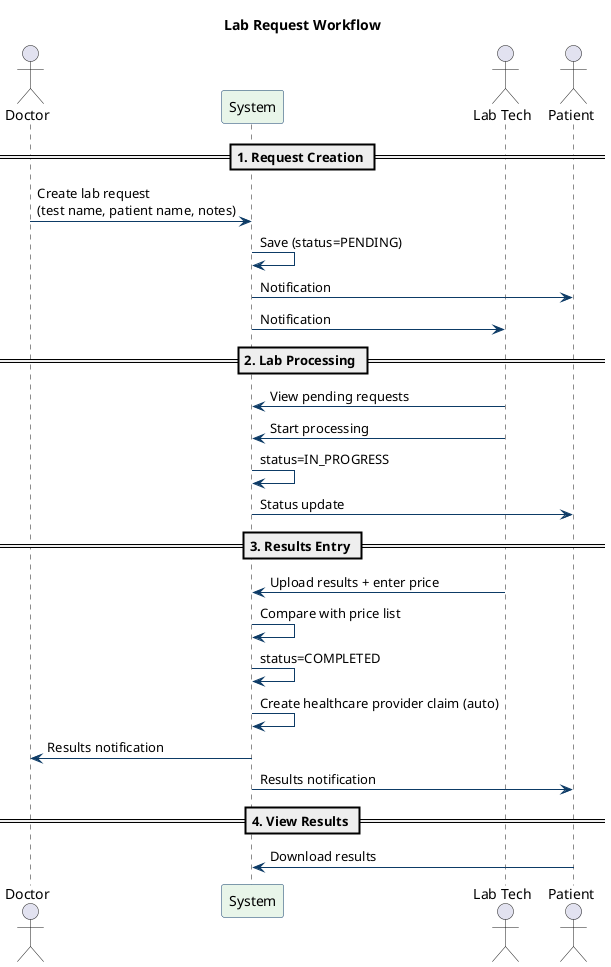

---

## 7. Sequence Diagram - Radiology Request Workflow

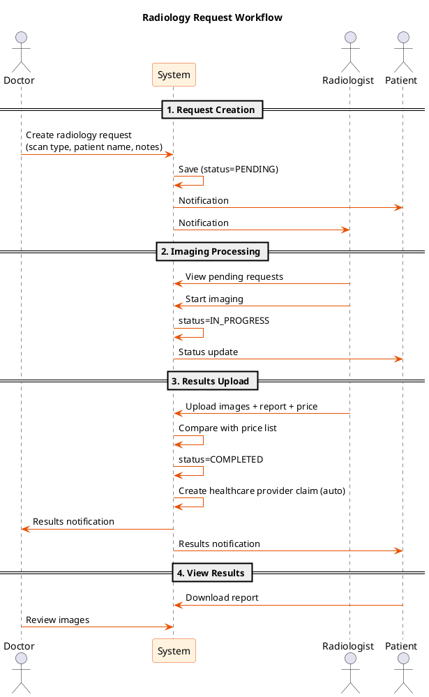

---

## 8. Sequence Diagram - Emergency Request Workflow

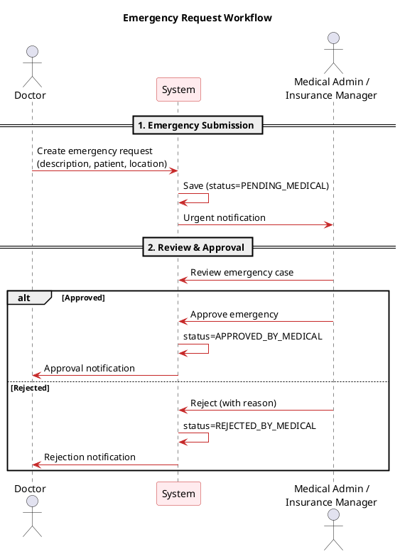

---

## 9. State Chart - Claim Status

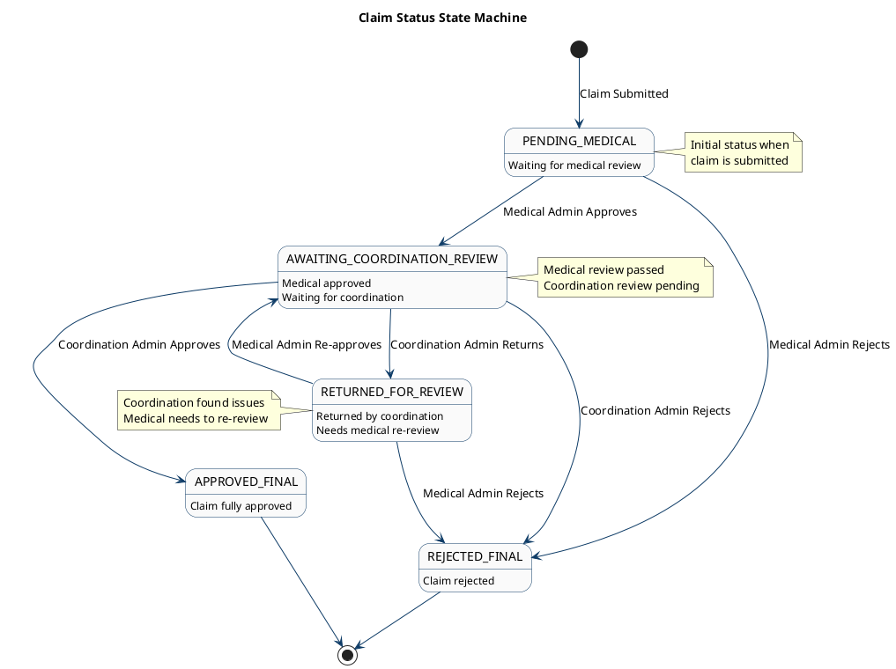

---

## 10. State Chart - Prescription Status

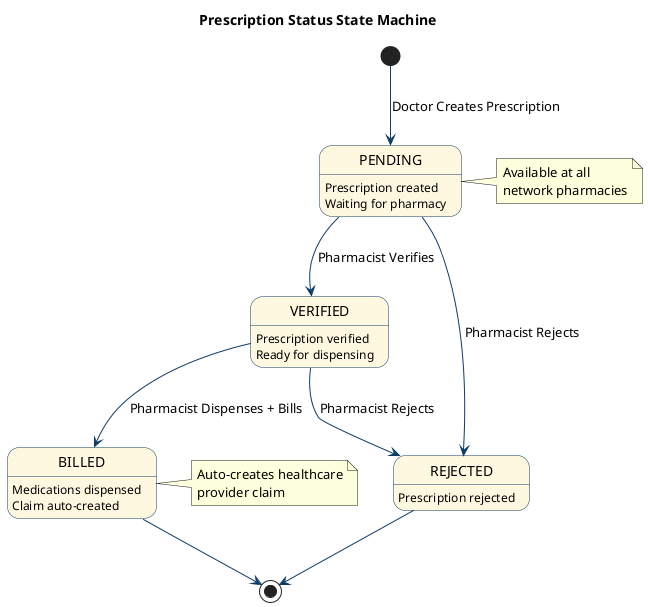

---

## 11. State Chart - Lab Request Status

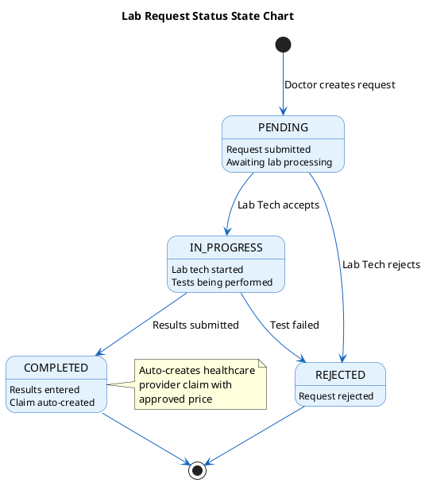

---

## 12. State Chart - Emergency Request Status

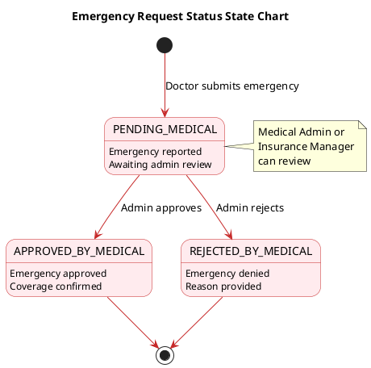

---

## 13. Activity Diagram - User Registration

```plantuml
@startuml Activity_User_Registration
skinparam activity {
    BackgroundColor #E8F5E9
    BorderColor #0D3B66
    ArrowColor #0D3B66
    DiamondBackgroundColor #FFF8E1
}

title User Registration Activity Diagram

start

:User navigates to Sign Up page;

:User selects account type;
note right
    - Insurance Client
    - Doctor
    - Pharmacist
    - Lab Technician
    - Radiologist
end note

:User fills registration form;
note right
    Required fields:
    - Full Name
    - Email
    - Password
    - National ID
    - Phone
    - Date of Birth

    Role-specific fields:
    - Employee ID (Doctors)
    - Specialization
    - Clinic Location
    - Pharmacy/Lab/Radiology Code
end note

if (All required fields filled?) then (no)
    :Display validation errors;
    backward:Return to form;
else (yes)
endif

:Submit registration form;

:System validates data;

if (Email already exists?) then (yes)
    :Display "Email already registered" error;
    stop
else (no)
endif

if (National ID already exists?) then (yes)
    :Display "National ID already registered" error;
    stop
else (no)
endif

:Create user account;
:Set status = ACTIVE;
:Set emailVerified = false;

if (Role = Insurance Client?) then (yes)
    :Account created immediately;
    :Generate email verification code;
    :Send verification email;
    :Redirect to email verification page;
else (no)
    :Set roleRequestStatus = PENDING;
    :Notify Insurance Manager;
    :Display "Registration pending approval" message;
endif

if (User verifies email?) then (yes)
    :Set emailVerified = true;
    :Account fully activated;
    :Redirect to login page;
else (no)
    :Account remains unverified;
endif

stop

@enduml
```

---

## 14. Activity Diagram - Claims Processing

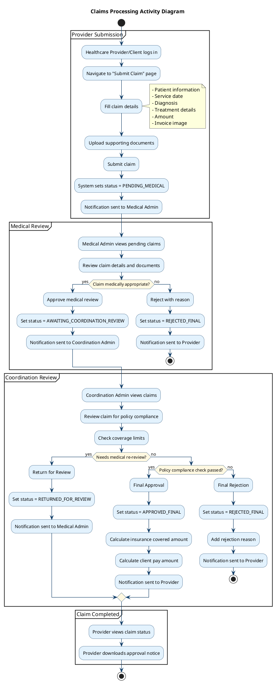

---

## 15. Component Diagram

```plantuml
@startuml Component_Diagram
skinparam component {
    BackgroundColor #E8F5E9
    BorderColor #0D3B66
    ArrowColor #0D3B66
}

title System Component Architecture

package "Client Layer" {
    [Web Browser] as Browser
    [Mobile Browser] as Mobile
}

package "Frontend (React 19)" {
    [App Component] as App
    [React Router] as Router
    [Material-UI Components] as MUI
    [Axios HTTP Client] as Axios
    [Leaflet Maps] as Leaflet
    [i18n (EN/AR)] as i18n

    package "Role Dashboards" {
        [Manager Dashboard] as ManagerDash
        [Client Dashboard] as ClientDash
        [Doctor Dashboard] as DoctorDash
        [Pharmacist Dashboard] as PharmDash
        [Lab Tech Dashboard] as LabDash
        [Radiologist Dashboard] as RadDash
        [Medical Admin Dashboard] as MedAdminDash
        [Coordination Dashboard] as CoordDash
    }

    package "Shared Components" {
        [Auth Components] as Auth
        [Claims Components] as Claims
        [Prescription Components] as Rx
        [Map Components] as Maps
        [Notification Components] as Notif
    }
}

package "Backend (Spring Boot)" {
    package "Controller Layer" {
        [AuthController] as AuthCtrl
        [ClientController] as ClientCtrl
        [ClaimController] as ClaimCtrl
        [PrescriptionController] as RxCtrl
        [LabRequestController] as LabCtrl
        [RadiologyController] as RadCtrl
        [EmergencyController] as EmergCtrl
        [NotificationController] as NotifCtrl
    }

    package "Service Layer" {
        [AuthService] as AuthSvc
        [ClientService] as ClientSvc
        [ClaimService] as ClaimSvc
        [PrescriptionService] as RxSvc
        [LabService] as LabSvc
        [NotificationService] as NotifSvc
    }

    package "Security" {
        [JWT Filter] as JWT
        [Security Config] as SecConfig
    }

    package "Data Layer" {
        [JPA Repositories] as Repos
    }
}

package "Database" {
    database "PostgreSQL" as DB
}

package "External Services" {
    [Email Service (SMTP)] as Email
    [File Storage] as Storage
}

' Connections
Browser --> App : HTTPS
Mobile --> App : HTTPS

App --> Router
App --> MUI
App --> i18n

Axios --> AuthCtrl : REST API
Axios --> ClaimCtrl : REST API
Axios --> RxCtrl : REST API
Axios --> LabCtrl : REST API

AuthCtrl --> JWT
JWT --> SecConfig

AuthCtrl --> AuthSvc
ClaimCtrl --> ClaimSvc
RxCtrl --> RxSvc
LabCtrl --> LabSvc

AuthSvc --> Repos
ClaimSvc --> Repos
RxSvc --> Repos

Repos --> DB

NotifSvc --> Email
ClaimSvc --> Storage

@enduml
```

---

## 16. Deployment Diagram

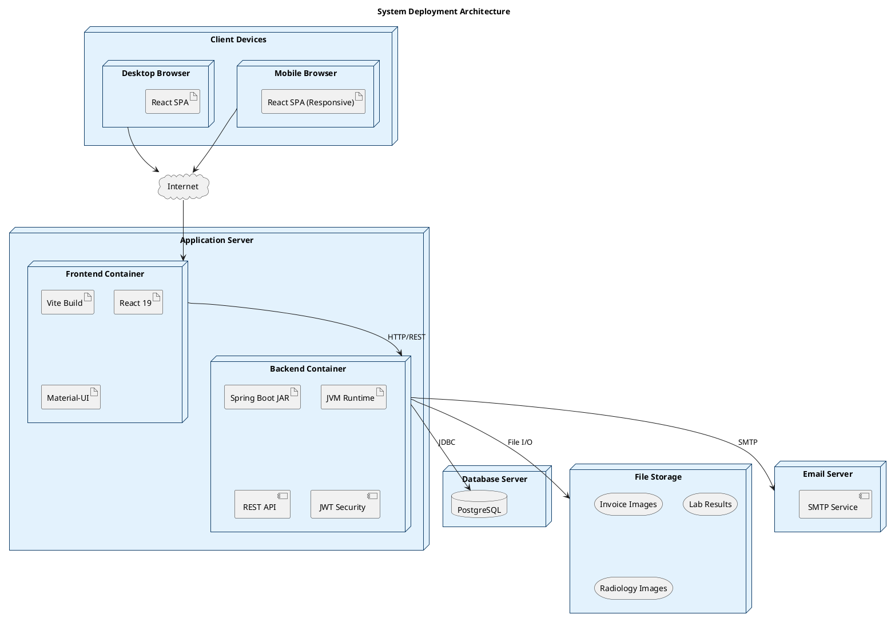

---

## 17. Data Flow Diagram (Context Level - DFD Level 0)

```plantuml
@startuml DFD_Context_Level
skinparam rectangle {
    BackgroundColor #E8F5E9
    BorderColor #0D3B66
}

title Data Flow Diagram - Context Level (DFD Level 0)

' External Entities
actor "Insurance Client" as Client
actor "Healthcare Provider\n(Doctor/Pharmacist/Lab/Radiologist)" as Provider
actor "Medical Admin" as MedAdmin
actor "Coordination Admin" as CoordAdmin
actor "Insurance Manager" as Manager

' System
rectangle "Birzeit University\nInsurance System" as System #LightBlue

' Data Stores
database "PostgreSQL\nDatabase" as DB

' External Systems
cloud "Email Service" as Email
cloud "File Storage" as Storage

' Data Flows from Client
Client --> System : Registration Data
Client --> System : Claim Submissions
Client --> System : Family Member Data
System --> Client : Policy Information
System --> Client : Claim Status Updates
System --> Client : Prescriptions
System --> Client : Notifications

' Data Flows from Provider
Provider --> System : Service Claims
Provider --> System : Prescriptions
Provider --> System : Lab/Radiology Requests
Provider --> System : Profile Registration
System --> Provider : Patient Information
System --> Provider : Claim Status
System --> Provider : Notifications

' Data Flows from Medical Admin
MedAdmin --> System : Medical Decisions
MedAdmin --> System : Chronic Patient Management
MedAdmin --> System : Emergency Approvals
System --> MedAdmin : Pending Claims
System --> MedAdmin : Reports

' Data Flows from Coordination Admin
CoordAdmin --> System : Final Decisions
CoordAdmin --> System : Return Requests
System --> CoordAdmin : Reviewed Claims
System --> CoordAdmin : Reports

' Data Flows from Manager
Manager --> System : Policy Management
Manager --> System : User Approvals
Manager --> System : Price List Updates
Manager --> System : Emergency Approvals
System --> Manager : System Reports
System --> Manager : Dashboard Statistics

' System to Data Stores
System <--> DB : All System Data
System --> Email : Notification Emails
System <--> Storage : File Upload/Download

@enduml
```

---

## 18. API Endpoints Diagram

```plantuml
@startuml API_Endpoints
!theme plain
skinparam backgroundColor #FEFEFE

title REST API Endpoints Structure

skinparam package {
    BackgroundColor #F5F5F5
    BorderColor #424242
}

skinparam rectangle {
    BackgroundColor #E3F2FD
    BorderColor #1565C0
}

package "Authentication API" #E8F5E9 {
    rectangle "POST /api/auth/login" as login #C8E6C9
    rectangle "GET /api/auth/me" as authMe #C8E6C9
    rectangle "POST /api/auth/register" as register #C8E6C9
    rectangle "POST /api/auth/verify-email" as verify #C8E6C9
    rectangle "POST /api/auth/forgot-password" as forgot #C8E6C9
    rectangle "POST /api/auth/reset-password" as reset #C8E6C9
}

package "Claims API" #FFF3E0 {
    rectangle "POST /api/claims/create" as createClaim #FFE0B2
    rectangle "GET /api/claims/allClaimForOneMember" as memberClaims #FFE0B2
    rectangle "GET /api/claims/allClaimsByManager" as allClaims #FFE0B2
    rectangle "PATCH /api/claims/{id}/approve" as approveClaim #FFE0B2
    rectangle "PATCH /api/claims/{id}/reject" as rejectClaim #FFE0B2
}

package "Healthcare Provider Claims API" #E3F2FD {
    rectangle "POST /api/healthcare-provider-claims/submit" as submitHPC #BBDEFB
    rectangle "GET /api/healthcare-provider-claims/my-claims" as myHPC #BBDEFB
    rectangle "GET /api/healthcare-provider-claims/medical-review" as medReview #BBDEFB
    rectangle "GET /api/healthcare-provider-claims/coordination-review" as coordReview #BBDEFB
}

package "Prescriptions API" #F3E5F5 {
    rectangle "POST /api/prescriptions/create" as createRx #E1BEE7
    rectangle "GET /api/prescriptions/get" as getRx #E1BEE7
    rectangle "GET /api/prescriptions/pending" as pendingRx #E1BEE7
    rectangle "GET /api/prescriptions/doctor/my" as doctorRx #E1BEE7
    rectangle "PATCH /api/prescriptions/{id}/verify" as verifyRx #E1BEE7
    rectangle "PATCH /api/prescriptions/{id}/bill" as billRx #E1BEE7
    rectangle "PATCH /api/prescriptions/{id}/reject" as rejectRx #E1BEE7
}

package "Lab Requests API" #E8EAF6 {
    rectangle "POST /api/labs/create" as createLab #C5CAE9
    rectangle "GET /api/labs/pending" as pendingLabs #C5CAE9
    rectangle "GET /api/labs/doctor/my" as doctorLabs #C5CAE9
    rectangle "GET /api/labs/my-requests" as myLabs #C5CAE9
    rectangle "PATCH /api/labs/{id}/upload" as uploadLab #C5CAE9
}

package "Radiology Requests API" #FCE4EC {
    rectangle "POST /api/radiology/create" as createRad #F8BBD9
    rectangle "GET /api/radiology/pending" as pendingRad #F8BBD9
    rectangle "GET /api/radiology/doctor/my" as doctorRad #F8BBD9
    rectangle "GET /api/radiology/my-requests" as myRad #F8BBD9
    rectangle "PATCH /api/radiology/{id}/uploadResult" as uploadRad #F8BBD9
}

package "Emergency Requests API" #FFEBEE {
    rectangle "POST /api/emergencies/create" as createEmerg #FFCDD2
    rectangle "GET /api/emergencies/all" as allEmerg #FFCDD2
    rectangle "GET /api/emergencies/doctor/my-requests" as doctorEmerg #FFCDD2
    rectangle "PATCH /api/emergencies/{id}/approve" as approveEmerg #FFCDD2
    rectangle "PATCH /api/emergencies/{id}/reject" as rejectEmerg #FFCDD2
}

package "Medical Admin API" #E8EAF6 {
    rectangle "GET /api/medical-admin/dashboard" as medDash #C5CAE9
    rectangle "GET /api/medical-admin/chronic-patients" as chronic #C5CAE9
    rectangle "POST /api/medical-admin/create-chronic-schedule" as createSched #C5CAE9
}

package "Other APIs" #ECEFF1 {
    rectangle "GET /api/notifications" as notif #CFD8DC
    rectangle "GET /api/policies/all" as policies #CFD8DC
    rectangle "GET /api/pricelist/{type}" as prices #CFD8DC
    rectangle "GET /api/family-members/my" as family #CFD8DC
    rectangle "GET /api/search-profiles/approved" as profiles #CFD8DC
}

note bottom of createClaim
  **HTTP Methods:**
  GET - Retrieve data
  POST - Create/Action
  PATCH - Update
  DELETE - Remove

  **Authorization:**
  JWT Bearer token required
  for all endpoints except
  /auth/login and /auth/register
end note

@enduml
```

---

## 19. Role Permission Matrix Diagram

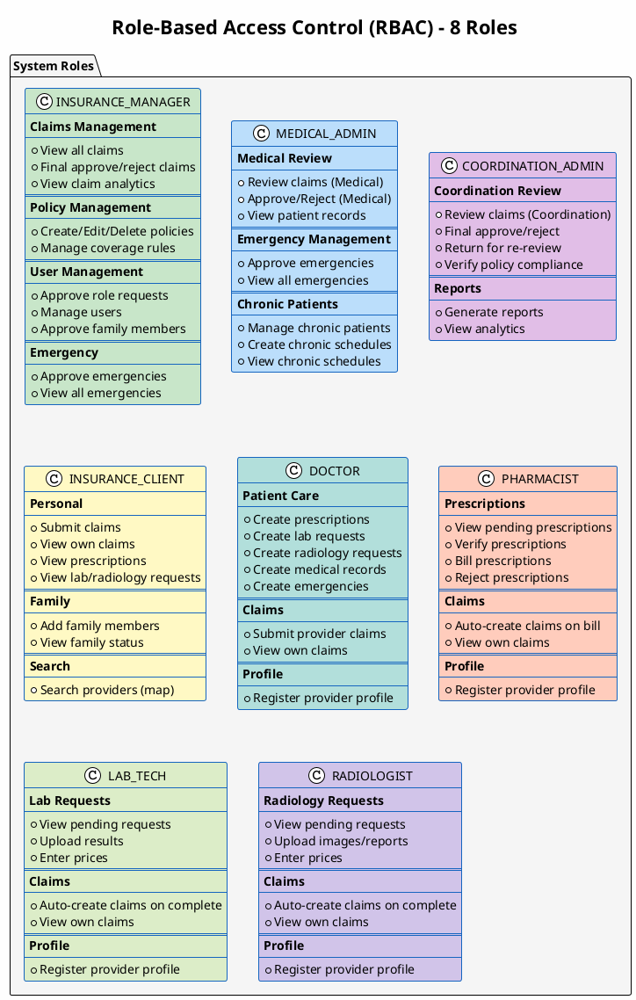

---

## 20. Frontend Component Architecture

```plantuml
@startuml Frontend_Architecture
!theme plain
skinparam backgroundColor #FEFEFE
skinparam componentStyle uml2

title React Frontend Component Architecture

skinparam component {
    BackgroundColor #E3F2FD
    BorderColor #1565C0
}

package "Application Shell" #F5F5F5 {
    component [App.jsx] as App #BBDEFB
    component [Router\n(React Router)] as Router #BBDEFB
    component [ThemeProvider\n(Material-UI)] as Theme #E1BEE7
    component [LanguageContext\n(i18n EN/AR)] as i18n #FFF9C4
}

package "Layout Components" #E8F5E9 {
    component [MainLayout] as MainLayout #B2DFDB
    component [Sidebar] as Sidebar #B2DFDB
    component [Header] as Header #B2DFDB
}

package "Authentication" #FFEBEE {
    component [LoginPage] as Login #FFCDD2
    component [RegisterPage] as Register #FFCDD2
    component [VerifyEmail] as Verify #FFCDD2
    component [ProtectedRoute] as Protected #FFCDD2
}

package "Dashboard Pages (8 Roles)" #E3F2FD {
    component [InsuranceManagerDashboard] as IMDash #90CAF9
    component [MedicalAdminDashboard] as MADash #90CAF9
    component [CoordinationDashboard] as CADash #90CAF9
    component [ClientDashboard] as CLDash #90CAF9
    component [DoctorDashboard] as DOCDash #90CAF9
    component [PharmacistDashboard] as PHDash #90CAF9
    component [LabTechDashboard] as LABDash #90CAF9
    component [RadiologistDashboard] as RADDash #90CAF9
}

package "Doctor Components" #E8F5E9 {
    component [AddPrescription] as AddRx #B2DFDB
    component [AddLabRequest] as AddLab #B2DFDB
    component [AddRadiologyRequest] as AddRad #B2DFDB
    component [AddMedicalRecord] as AddMedRec #B2DFDB
    component [PrescriptionsList] as RxList #B2DFDB
    component [LabRequestsList] as LabList #B2DFDB
}

package "Pharmacist Components" #FFF3E0 {
    component [PendingPrescriptions] as PendingRx #FFE0B2
    component [VerifyPrescription] as VerifyRx #FFE0B2
}

package "Lab/Radiology Components" #E8EAF6 {
    component [PendingLabRequests] as PendingLab #C5CAE9
    component [UploadLabResult] as UploadLab #C5CAE9
    component [PendingRadiology] as PendingRad #C5CAE9
    component [UploadRadResult] as UploadRad #C5CAE9
}

package "Claims Components" #FFF3E0 {
    component [ClaimsList] as ClaimsList #FFE0B2
    component [SubmitClaim] as SubmitClaim #FFE0B2
    component [MedicalReview] as MedReview #FFE0B2
    component [CoordinationReview] as CoordReview #FFE0B2
}

package "Map Components" #E8F5E9 {
    component [ProviderMap\n(Leaflet)] as Map #A5D6A7
    component [MapFilter] as MapFilter #A5D6A7
}

package "Services Layer" #FFF8E1 {
    component [API Client\n(Axios)] as API #FFE082
    component [Auth Service] as AuthSvc #FFE082
}

' Connections
App --> Router
App --> Theme
App --> i18n

Router --> Protected
Protected --> MainLayout

MainLayout --> Sidebar
MainLayout --> Header

Router --> Login
Router --> Register

MainLayout --> IMDash
MainLayout --> MADash
MainLayout --> CADash
MainLayout --> CLDash
MainLayout --> DOCDash
MainLayout --> PHDash
MainLayout --> LABDash
MainLayout --> RADDash

DOCDash --> AddRx
DOCDash --> AddLab
DOCDash --> AddRad
DOCDash --> AddMedRec

PHDash --> PendingRx
LABDash --> PendingLab
RADDash --> PendingRad

CLDash --> Map
IMDash --> ClaimsList
MADash --> MedReview
CADash --> CoordReview

@enduml
```

---

## Notes for Report

### How to Generate These Diagrams:

1. **Online Tools:**
   - PlantUML Online Server: https://www.plantuml.com/plantuml/uml/
   - PlantText: https://www.planttext.com/

2. **IDE Plugins:**
   - VS Code: PlantUML extension
   - IntelliJ IDEA: PlantUML integration

3. **Command Line:**
   ```bash
   java -jar plantuml.jar diagram.puml
   ```

### Diagram Descriptions:

| # | Diagram | Purpose |
|---|---------|---------|
| 1 | Use Case Diagram | Maps all 8 actors to their available system functions |
| 2 | ER Diagram | Shows database schema with all tables and relationships |
| 3 | Class Diagram | Shows entity classes with attributes and relationships |
| 4 | Sequence - Claims | Shows the two-tier claim approval workflow (Medical -> Coordination) |
| 5 | Sequence - Prescription | Shows prescription creation, verification, and billing |
| 6 | Sequence - Lab Request | Shows lab request workflow with auto-claim creation |
| 7 | Sequence - Radiology | Shows radiology workflow with auto-claim creation |
| 8 | Sequence - Emergency | Shows emergency request workflow (Medical Admin/Manager approval) |
| 9 | State - Claim | Shows claim status transitions (5 states) |
| 10 | State - Prescription | Shows prescription status lifecycle (4 states) |
| 11 | State - Lab Request | Shows lab request status transitions (4 states) |
| 12 | State - Emergency | Shows emergency status transitions (3 states) |
| 13 | Activity - Registration | Shows user registration flow with email verification |
| 14 | Activity - Claims | Shows complete claims processing workflow |
| 15 | Component Diagram | Shows system component architecture |
| 16 | Deployment Diagram | Shows physical deployment topology |
| 17 | DFD Context | Shows system context and data flows |
| 18 | API Endpoints | Complete REST API endpoint structure |
| 19 | Role Permission Matrix | Visual representation of all 8 roles and their permissions |
| 20 | Frontend Architecture | React component hierarchy and module organization |

### Key System Information:

- **8 User Roles**: Insurance Client, Doctor, Pharmacist, Lab Tech, Radiologist, Medical Admin, Coordination Admin, Insurance Manager
- **No Emergency Manager Role**: Emergencies are approved by Medical Admin or Insurance Manager
- **Two-Tier Claim Review**: Medical Admin -> Coordination Admin
- **Auto-Claim Creation**: Pharmacist billing, Lab results upload, and Radiology results upload automatically create healthcare provider claims
- **Bilingual Support**: English and Arabic (RTL) with i18n
