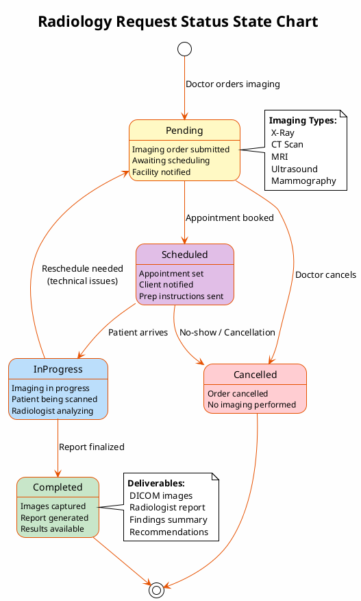
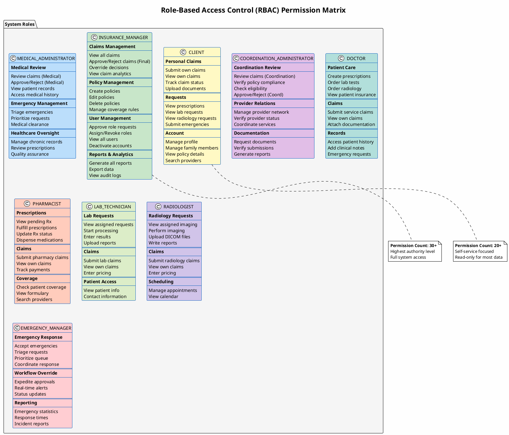

# Birzeit University Insurance System - PlantUML Diagrams

## 1. Entity Relationship Diagram (ER Diagram)


---

## 2. Use Case Diagram


---

## 3. Class Diagram


---

## 4. Sequence Diagram - Claims Workflow


---

## 5. Sequence Diagram - Prescription Workflow


---

## 6. Activity Diagram - User Registration

```plantuml
@startuml Activity_User_Registration
skinparam activity {
    BackgroundColor #E8F5E9
    BorderColor #0D3B66
    ArrowColor #0D3B66
    DiamondBackgroundColor #FFF8E1
}

title User Registration Activity Diagram

start

:User navigates to Sign Up page;

:User selects account type;
note right
    - Insurance Client
    - Doctor
    - Pharmacist
    - Lab Technician
    - Radiologist
end note

:User fills registration form;
note right
    Required fields:
    - Full Name
    - Email
    - Password
    - National ID
    - Phone
    - Date of Birth

    Role-specific fields:
    - Employee ID (Doctors)
    - Specialization
    - Clinic Location
    - Pharmacy/Lab/Radiology Code
end note

if (All required fields filled?) then (no)
    :Display validation errors;
    :User corrects errors;
    backward:Return to form;
else (yes)
endif

:Submit registration form;

:System validates data;

if (Email already exists?) then (yes)
    :Display "Email already registered" error;
    stop
else (no)
endif

if (National ID already exists?) then (yes)
    :Display "National ID already registered" error;
    stop
else (no)
endif

:Create user account;
:Set status = ACTIVE;
:Set emailVerified = false;

if (Role = Insurance Client?) then (yes)
    :Account created immediately;
    :Generate email verification code;
    :Send verification email;
    :Redirect to email verification page;
else (no)
    :Set roleRequestStatus = PENDING;
    :Notify Insurance Manager;
    :Display "Registration pending approval" message;
endif

if (User verifies email?) then (yes)
    :Set emailVerified = true;
    :Account fully activated;
    :Redirect to login page;
else (no)
    :Account remains unverified;
    note right: User cannot login until\nemail is verified
endif

stop

@enduml
```

---

## 7. Activity Diagram - Claims Processing


---

## 8. State Chart - Claim Status


---

## 9. State Chart - Prescription Status


---

## 10. Component Diagram


---

## 11. Deployment Diagram


---

## 12. Data Flow Diagram (Context Level - DFD Level 0)


---

## 13. System Architecture Overview


---

## 14. Sequence Diagram - Lab Request Workflow


---

## 15. Sequence Diagram - Radiology Request Workflow


---

## 16. Sequence Diagram - Emergency Request Workflow


---

## 17. State Chart - Lab Request Status


---

## 18. State Chart - Radiology Request Status



---

## 19. State Chart - Emergency Request Status


---

## 20. Role Permission Matrix Diagram



---

## 21. Frontend Component Architecture Diagram

```plantuml
@startuml Frontend_Architecture
!theme plain
skinparam backgroundColor #FEFEFE
skinparam componentStyle uml2

title React Frontend Component Architecture

skinparam component {
    BackgroundColor #E3F2FD
    BorderColor #1565C0
}

package "Application Shell" #F5F5F5 {
    component [App.jsx] as App #BBDEFB
    component [Router\n(React Router v6)] as Router #BBDEFB
    component [ThemeProvider\n(Material-UI)] as Theme #E1BEE7
    component [I18nProvider\n(react-i18next)] as I18n #FFF9C4
    component [QueryProvider\n(React Query)] as Query #C8E6C9
}

package "Layout Components" #E8F5E9 {
    component [MainLayout] as MainLayout #B2DFDB
    component [Sidebar] as Sidebar #B2DFDB
    component [Header] as Header #B2DFDB
    component [Footer] as Footer #B2DFDB
}

package "Authentication" #FFEBEE {
    component [LoginPage] as Login #FFCDD2
    component [RegisterPage] as Register #FFCDD2
    component [ProtectedRoute] as Protected #FFCDD2
    component [AuthContext] as AuthCtx #FFCDD2
}

package "Dashboard Pages" #E3F2FD {
    component [InsuranceManagerDashboard] as IMDash #90CAF9
    component [MedicalAdminDashboard] as MADash #90CAF9
    component [CoordinationDashboard] as CADash #90CAF9
    component [ClientDashboard] as CLDash #90CAF9
    component [DoctorDashboard] as DOCDash #90CAF9
    component [PharmacistDashboard] as PHDash #90CAF9
    component [LabTechDashboard] as LABDash #90CAF9
    component [RadiologistDashboard] as RADDash #90CAF9
    component [EmergencyDashboard] as EMDash #90CAF9
}

package "Claims Module" #FFF3E0 {
    component [ClaimsList] as ClaimsList #FFE0B2
    component [ClaimDetails] as ClaimDetails #FFE0B2
    component [SubmitClaim] as SubmitClaim #FFE0B2
    component [ClaimReview] as ClaimReview #FFE0B2
}

package "Prescription Module" #F3E5F5 {
    component [PrescriptionsList] as RxList #E1BEE7
    component [CreatePrescription] as CreateRx #E1BEE7
    component [PrescriptionDetails] as RxDetails #E1BEE7
    component [FulfillPrescription] as FulfillRx #E1BEE7
}

package "Lab/Radiology Module" #E8EAF6 {
    component [LabRequestsList] as LabList #C5CAE9
    component [CreateLabRequest] as CreateLab #C5CAE9
    component [RadiologyRequestsList] as RadList #C5CAE9
    component [CreateRadiologyRequest] as CreateRad #C5CAE9
    component [ResultsViewer] as Results #C5CAE9
}

package "Emergency Module" #FFEBEE {
    component [EmergencyList] as EmergList #FFCDD2
    component [SubmitEmergency] as SubmitEmerg #FFCDD2
    component [EmergencyTriage] as Triage #FFCDD2
}

package "Shared Components" #ECEFF1 {
    component [DataTable] as DataTable #CFD8DC
    component [FormComponents] as Forms #CFD8DC
    component [SearchBar] as Search #CFD8DC
    component [FileUpload] as Upload #CFD8DC
    component [NotificationToast] as Toast #CFD8DC
    component [LoadingSpinner] as Spinner #CFD8DC
    component [ConfirmDialog] as Dialog #CFD8DC
}

package "Map Components" #E8F5E9 {
    component [ProviderMap\n(Leaflet)] as Map #A5D6A7
    component [MapMarkers] as Markers #A5D6A7
    component [LocationPicker] as Location #A5D6A7
}

package "Services Layer" #FFF8E1 {
    component [API Client\n(Axios)] as API #FFE082
    component [Auth Service] as AuthSvc #FFE082
    component [Claims Service] as ClaimsSvc #FFE082
    component [Request Services] as ReqSvc #FFE082
}

' Connections
App --> Router
App --> Theme
App --> I18n
App --> Query

Router --> Protected
Protected --> AuthCtx
Protected --> MainLayout

MainLayout --> Sidebar
MainLayout --> Header
MainLayout --> Footer

Router --> Login
Router --> Register

MainLayout --> IMDash
MainLayout --> MADash
MainLayout --> CADash
MainLayout --> CLDash
MainLayout --> DOCDash
MainLayout --> PHDash
MainLayout --> LABDash
MainLayout --> RADDash
MainLayout --> EMDash

IMDash --> ClaimsList
CLDash --> SubmitClaim
MADash --> ClaimReview

DOCDash --> CreateRx
DOCDash --> CreateLab
DOCDash --> CreateRad
PHDash --> FulfillRx
LABDash --> Results
RADDash --> Results

EMDash --> EmergList
EMDash --> Triage
CLDash --> SubmitEmerg

ClaimsList --> DataTable
ClaimsList --> Search
SubmitClaim --> Forms
SubmitClaim --> Upload

Map --> Markers
CLDash --> Map

API --> AuthSvc
API --> ClaimsSvc
API --> ReqSvc

@enduml
```

---

## 22. API Endpoints Diagram

```plantuml
@startuml API_Endpoints
!theme plain
skinparam backgroundColor #FEFEFE

title REST API Endpoints Structure (Actual Implementation)

skinparam package {
    BackgroundColor #F5F5F5
    BorderColor #424242
}

skinparam rectangle {
    BackgroundColor #E3F2FD
    BorderColor #1565C0
}

package "Authentication API" #E8F5E9 {
    rectangle "POST /api/auth/register" as reg #C8E6C9
    rectangle "POST /api/auth/admin/register" as adminReg #C8E6C9
    rectangle "POST /api/auth/login" as login #C8E6C9
    rectangle "POST /api/auth/logout" as logout #C8E6C9
    rectangle "GET /api/auth/me" as authMe #C8E6C9
    rectangle "POST /api/auth/verify-email" as verify #C8E6C9
    rectangle "POST /api/auth/forgot-password" as forgot #C8E6C9
    rectangle "POST /api/auth/reset-password" as reset #C8E6C9
}

package "Client API" #E3F2FD {
    rectangle "GET /api/clients/list" as listClients #BBDEFB
    rectangle "GET /api/clients/me/update" as getMe #BBDEFB
    rectangle "PUT /api/clients/me/update" as updateMe #BBDEFB
    rectangle "GET /api/clients/search/employeeId/{id}" as searchEmp #BBDEFB
    rectangle "GET /api/clients/search/name/{name}" as searchName #BBDEFB
    rectangle "POST /api/clients/{id}/deactivate" as deactivate #BBDEFB
    rectangle "POST /api/clients/{id}/reactivate" as reactivate #BBDEFB
    rectangle "POST /api/clients/{id}/role-requests/approve" as approveRole #BBDEFB
}

package "Family Members API" #E1F5FE {
    rectangle "GET /api/family-members/my" as myFamily #B3E5FC
    rectangle "GET /api/family-members/pending" as pendingFamily #B3E5FC
    rectangle "POST /api/family-members/create" as createFamily #B3E5FC
    rectangle "POST /api/family-members/{id}/approve" as approveFamily #B3E5FC
    rectangle "POST /api/family-members/{id}/reject" as rejectFamily #B3E5FC
}

package "Healthcare Provider Claims API" #FFF3E0 {
    rectangle "GET /api/healthcare-provider-claims/my-claims" as myClaims #FFE0B2
    rectangle "GET /api/healthcare-provider-claims/medical-review" as medReview #FFE0B2
    rectangle "GET /api/healthcare-provider-claims/coordination-review" as coordReview #FFE0B2
    rectangle "GET /api/healthcare-provider-claims/final-decisions" as finalDec #FFE0B2
    rectangle "POST /api/healthcare-provider-claims/create" as createClaim #FFE0B2
    rectangle "POST /api/healthcare-provider-claims/client/create" as clientClaim #FFE0B2
    rectangle "POST /api/healthcare-provider-claims/admin/create-direct" as adminClaim #FFE0B2
    rectangle "POST /api/healthcare-provider-claims/{id}/approve-medical" as approveMed #FFE0B2
    rectangle "POST /api/healthcare-provider-claims/{id}/reject-medical" as rejectMed #FFE0B2
    rectangle "POST /api/healthcare-provider-claims/{id}/return-to-medical" as returnMed #FFE0B2
    rectangle "POST /api/healthcare-provider-claims/reports/pdf" as claimPdf #FFE0B2
}

package "Prescriptions API" #F3E5F5 {
    rectangle "GET /api/prescriptions/get" as getRx #E1BEE7
    rectangle "GET /api/prescriptions/all" as allRx #E1BEE7
    rectangle "GET /api/prescriptions/pending" as pendingRx #E1BEE7
    rectangle "POST /api/prescriptions/create" as createRx #E1BEE7
    rectangle "POST /api/prescriptions/{id}/verify" as verifyRx #E1BEE7
    rectangle "POST /api/prescriptions/{id}/bill" as billRx #E1BEE7
    rectangle "POST /api/prescriptions/{id}/reject" as rejectRx #E1BEE7
    rectangle "GET /api/prescriptions/available-items" as availItems #E1BEE7
    rectangle "GET /api/prescriptions/check-active/{name}/{medId}" as checkActive #E1BEE7
}

package "Lab Requests API" #E8EAF6 {
    rectangle "GET /api/labs/my-requests" as myLabs #C5CAE9
    rectangle "GET /api/labs/doctor/my" as doctorLabs #C5CAE9
    rectangle "GET /api/labs/pending" as pendingLabs #C5CAE9
    rectangle "GET /api/labs/getByMember" as memberLabs #C5CAE9
    rectangle "POST /api/labs/create" as createLab #C5CAE9
    rectangle "POST /api/labs/{id}/upload" as uploadLab #C5CAE9
    rectangle "GET /api/labs/available-tests" as labTests #C5CAE9
}

package "Radiology Requests API" #FCE4EC {
    rectangle "GET /api/radiology/my-requests" as myRad #F8BBD9
    rectangle "GET /api/radiology/doctor/my" as doctorRad #F8BBD9
    rectangle "GET /api/radiology/pending" as pendingRad #F8BBD9
    rectangle "GET /api/radiology/getByMember" as memberRad #F8BBD9
    rectangle "POST /api/radiology/create" as createRad #F8BBD9
    rectangle "POST /api/radiology/{id}/uploadResult" as uploadRad #F8BBD9
    rectangle "GET /api/radiology/available-tests" as radTests #F8BBD9
}

package "Emergency Requests API" #FFEBEE {
    rectangle "GET /api/emergencies/all" as allEmerg #FFCDD2
    rectangle "GET /api/emergencies/doctor/my-requests" as doctorEmerg #FFCDD2
    rectangle "POST /api/emergencies/create" as createEmerg #FFCDD2
}

package "Search Profiles API" #E0F7FA {
    rectangle "GET /api/search-profiles/all" as allProfiles #B2EBF2
    rectangle "GET /api/search-profiles/approved" as approvedProfiles #B2EBF2
    rectangle "GET /api/search-profiles/my-profiles" as myProfiles #B2EBF2
    rectangle "POST /api/search-profiles/create" as createProfile #B2EBF2
    rectangle "POST /api/search-profiles/{id}/approve" as approveProfile #B2EBF2
    rectangle "POST /api/search-profiles/{id}/reject" as rejectProfile #B2EBF2
}

package "Policy API" #FFFDE7 {
    rectangle "GET /api/policies/all" as listPolicies #FFF9C4
    rectangle "POST /api/policies/create" as createPolicy #FFF9C4
    rectangle "PUT /api/policies/update/{id}" as updatePolicy #FFF9C4
    rectangle "DELETE /api/policies/delete/{id}" as deletePolicy #FFF9C4
    rectangle "GET /api/policies/{id}/coverages/all" as coverages #FFF9C4
    rectangle "POST /api/policies/{id}/coverages/add" as addCoverage #FFF9C4
}

package "Price List API" #F1F8E9 {
    rectangle "GET /api/pricelist/{type}" as getPriceList #DCEDC8
    rectangle "POST /api/pricelist" as createPrice #DCEDC8
    rectangle "PUT /api/pricelist/{id}" as updatePrice #DCEDC8
    rectangle "DELETE /api/pricelist/{id}" as deletePrice #DCEDC8
}

package "Notifications API" #FFF8E1 {
    rectangle "GET /api/notifications" as getNotif #FFECB3
    rectangle "GET /api/notifications/unread-count" as unreadCount #FFECB3
    rectangle "GET /api/notifications/unread-count/emergency" as emergCount #FFECB3
    rectangle "POST /api/notifications/{id}/read" as readNotif #FFECB3
    rectangle "POST /api/notifications/read-all" as readAll #FFECB3
    rectangle "POST /api/notifications/{id}/reply" as replyNotif #FFECB3
}

package "Reports API" #ECEFF1 {
    rectangle "GET /api/reports/claims" as claimsReport #CFD8DC
    rectangle "GET /api/reports/financial" as finReport #CFD8DC
    rectangle "GET /api/reports/usage" as usageReport #CFD8DC
    rectangle "GET /api/reports/policies" as polReport #CFD8DC
    rectangle "GET /api/reports/members-activity" as actReport #CFD8DC
    rectangle "GET /api/reports/providers" as provReport #CFD8DC
}

package "Medical Admin API" #E8EAF6 {
    rectangle "GET /api/medical-admin/dashboard" as medDash #C5CAE9
    rectangle "GET /api/medical-admin/chronic-patients" as chronic #C5CAE9
    rectangle "GET /api/medical-admin/chronic-schedules" as schedules #C5CAE9
    rectangle "POST /api/medical-admin/create-chronic-schedule" as createSched #C5CAE9
}

package "Chat API" #F3E5F5 {
    rectangle "GET/POST /api/chat" as chat #E1BEE7
    rectangle "WS /ws-chat" as wsChat #E1BEE7
}

note bottom of createClaim
  **HTTP Methods:**
  GET - Retrieve data
  POST - Create/Action
  PUT - Update
  DELETE - Remove

  **Authorization:**
  JWT Bearer token required
  for all endpoints except
  /auth/login and /auth/register
end note

@enduml
```

---

## 23. Activity Diagram - Lab Request Processing

```plantuml
@startuml Lab_Request_Activity
!theme plain
skinparam backgroundColor #FEFEFE
skinparam activityArrowColor #1565C0
skinparam activityBackgroundColor #E3F2FD
skinparam activityBorderColor #1565C0

title Lab Request Processing Activity Diagram

|#E8F5E9|Doctor|
|#FFF9C4|System|
|#FFE0B2|Lab Technician|
|#E3F2FD|Client|

|Doctor|
start
:Select patient from list;
:Enter lab test details;
note right
  - Test name
  - Clinical notes
  - Diagnosis
  - Urgency level
end note
:Submit lab request;

|System|
:Validate doctor permissions;
if (Doctor authorized?) then (yes)
    :Validate patient insurance;
    if (Insurance active?) then (yes)
        :Save request to database;
        :Set status = PENDING;
        :Send notification to client;
        :Send notification to assigned lab;
    else (no)
        :Return insurance error;
        |Doctor|
        :Show error message;
        stop
    endif
else (no)
    :Return authorization error;
    |Doctor|
    :Show error message;
    stop
endif

|Client|
:Receive notification;
:View pending lab request;

|Lab Technician|
:View pending requests;
:Select request to process;
:Start processing;

|System|
:Update status = IN_PROGRESS;
:Notify client of status change;

|Lab Technician|
:Perform laboratory tests;
:Analyze samples;
:Prepare results;
:Enter test results;
note right
  - Test values
  - Reference ranges
  - Notes
  - Result file
end note
:Submit results;

|System|
:Validate result data;
:Save results to database;
:Update status = COMPLETED;
:Store result file;
:Notify doctor;
:Notify client;

|Client|
:Receive completion notification;
:View test results;
:Download result report;

|Doctor|
:Review patient results;
:Add to patient record;

|System|
:Results available for\nclaim documentation;
stop

@enduml
```

---

## 24. Activity Diagram - Radiology Request Processing

```plantuml
@startuml Radiology_Request_Activity
!theme plain
skinparam backgroundColor #FEFEFE
skinparam activityArrowColor #E65100
skinparam activityBackgroundColor #FFF3E0
skinparam activityBorderColor #E65100

title Radiology Request Processing Activity Diagram

|#E8F5E9|Doctor|
|#FFF9C4|System|
|#E1BEE7|Radiologist|
|#E3F2FD|Client|

|Doctor|
start
:Select patient;
:Choose imaging type;
note right
  - X-Ray
  - CT Scan
  - MRI
  - Ultrasound
  - Mammography
end note
:Enter clinical indication;
:Specify body region;
:Submit radiology order;

|System|
:Validate doctor authorization;
if (Authorized?) then (yes)
    :Check patient coverage;
    if (Imaging covered?) then (yes)
        :Save request (PENDING);
        :Identify nearest facility;
        :Send notifications;
    else (no)
        :Return coverage error;
        |Doctor|
        :Inform patient of\nnon-coverage;
        stop
    endif
else (no)
    :Return auth error;
    |Doctor|
    :Show error;
    stop
endif

|Client|
:Receive notification;
:View imaging order;
:Note prep instructions;

|Radiologist|
:View pending orders;
:Review order details;
:Schedule appointment;

|System|
:Update status = SCHEDULED;
:Send appointment to client;

|Client|
:Receive appointment;
:Arrive at facility;

|Radiologist|
:Verify patient identity;
:Begin imaging;

|System|
:Update status = IN_PROGRESS;

|Radiologist|
:Perform imaging procedure;
fork
    :Capture DICOM images;
fork again
    :Monitor image quality;
end fork
:Review captured images;
if (Images acceptable?) then (yes)
    :Analyze findings;
    :Write radiology report;
    :Upload images and report;

    |System|
    :Store files securely;
    :Update status = COMPLETED;
    :Save pricing information;
    :Notify stakeholders;
else (no)
    :Reschedule imaging;
    |System|
    :Update status = PENDING;
    :Notify client;
    stop
endif

|Client|
:Receive results notification;
:View imaging report;
:Download DICOM files;

|Doctor|
:Review imaging results;
:Plan treatment based\non findings;
:Add to patient record;

|System|
:Results available for\ninsurance claims;
stop

@enduml
```

---

## 25. Notification Flow Diagram

```plantuml
@startuml Notification_Flow
!theme plain
skinparam backgroundColor #FEFEFE

title System Notification Flow Diagram

skinparam rectangle {
    BackgroundColor #E3F2FD
    BorderColor #1565C0
}

package "Trigger Events" #E8F5E9 {
    rectangle "Claim Submitted" as E1 #C8E6C9
    rectangle "Status Changed" as E2 #C8E6C9
    rectangle "Claim Approved/Rejected" as E3 #C8E6C9
    rectangle "Prescription Created" as E4 #C8E6C9
    rectangle "Lab Results Ready" as E5 #C8E6C9
    rectangle "Emergency Reported" as E6 #FFCDD2
    rectangle "Role Request" as E7 #C8E6C9
    rectangle "Document Required" as E8 #C8E6C9
}

package "Notification Service" #FFF3E0 {
    rectangle "Event Handler" as Handler #FFE0B2
    rectangle "Recipient Resolver" as Resolver #FFE0B2
    rectangle "Template Engine" as Template #FFE0B2
    rectangle "Channel Router" as Router #FFE0B2
}

package "Notification Channels" #E3F2FD {
    rectangle "Email Service\n(SMTP)" as Email #BBDEFB
    rectangle "Push Notifications\n(Browser/Mobile)" as Push #BBDEFB
    rectangle "In-App Notifications\n(Real-time)" as InApp #BBDEFB
    rectangle "SMS Gateway\n(Emergency only)" as SMS #FFCDD2
}

package "Recipients" #F3E5F5 {
    rectangle "Client" as RClient #E1BEE7
    rectangle "Doctor" as RDoctor #E1BEE7
    rectangle "Pharmacist" as RPharm #E1BEE7
    rectangle "Lab Technician" as RLab #E1BEE7
    rectangle "Radiologist" as RRad #E1BEE7
    rectangle "Medical Admin" as RMedAdmin #E1BEE7
    rectangle "Coord Admin" as RCoordAdmin #E1BEE7
    rectangle "Insurance Manager" as RInsMgr #E1BEE7
    rectangle "Emergency Manager" as REmergMgr #FFCDD2
}

' Event flows
E1 --> Handler
E2 --> Handler
E3 --> Handler
E4 --> Handler
E5 --> Handler
E6 --> Handler
E7 --> Handler
E8 --> Handler

Handler --> Resolver
Resolver --> Template
Template --> Router

Router --> Email
Router --> Push
Router --> InApp
Router --> SMS

' Channel to recipient flows
Email --> RClient
Email --> RDoctor
Email --> RMedAdmin
Email --> RInsMgr

Push --> RClient
Push --> RDoctor
Push --> RPharm
Push --> RLab
Push --> RRad

InApp --> RClient
InApp --> RDoctor
InApp --> RPharm
InApp --> RLab
InApp --> RRad
InApp --> RMedAdmin
InApp --> RCoordAdmin
InApp --> RInsMgr

SMS --> REmergMgr
SMS --> RClient

note right of E6
  **Emergency Priority:**
  SMS + Push + In-App
  sent simultaneously
end note

note bottom of Router
  **Channel Selection:**
   Email: Detailed notifications
   Push: Real-time alerts
   In-App: Dashboard updates
   SMS: Emergencies only
end note

@enduml
```

---

## 26. Data Flow Diagram - Level 1

```plantuml
@startuml DFD_Level1
!theme plain
skinparam backgroundColor #FEFEFE

title Data Flow Diagram - Level 1 (Detailed)

skinparam rectangle {
    RoundCorner 25
}

' External Entities
actor "Client/Member" as Client #A5D6A7
actor "Healthcare Provider\n(Doctor/Pharmacist/Lab/Rad)" as Provider #90CAF9
actor "Insurance Staff\n(Manager/Admin)" as Staff #FFB74D

' Processes
rectangle "1.0\nUser Management" as P1 #E1BEE7
rectangle "2.0\nClaims Processing" as P2 #BBDEFB
rectangle "3.0\nPrescription\nManagement" as P3 #C8E6C9
rectangle "4.0\nLab/Radiology\nManagement" as P4 #FFF9C4
rectangle "5.0\nEmergency\nHandling" as P5 #FFCDD2
rectangle "6.0\nPolicy\nManagement" as P6 #B2DFDB
rectangle "7.0\nReporting &\nAnalytics" as P7 #D7CCC8

' Data Stores
database "D1: Clients" as D1 #ECEFF1
database "D2: Claims" as D2 #ECEFF1
database "D3: Prescriptions" as D3 #ECEFF1
database "D4: Lab/Radiology\nRequests" as D4 #ECEFF1
database "D5: Emergency\nRequests" as D5 #ECEFF1
database "D6: Policies" as D6 #ECEFF1
database "D7: Audit Logs" as D7 #ECEFF1

' Client flows
Client --> P1 : Registration data
P1 --> Client : Account confirmation
Client --> P2 : Claim submission
P2 --> Client : Claim status
Client --> P5 : Emergency request
P5 --> Client : Emergency status

' Provider flows
Provider --> P2 : Service claims
P2 --> Provider : Payment status
Provider --> P3 : Prescriptions
P3 --> Provider : Fulfillment status
Provider --> P4 : Lab/Radiology orders
P4 --> Provider : Test results

' Staff flows
Staff --> P2 : Review decisions
P2 --> Staff : Claims for review
Staff --> P6 : Policy updates
P6 --> Staff : Policy data
Staff --> P7 : Report requests
P7 --> Staff : Generated reports

' Process to Data Store flows
P1 <--> D1 : Client records
P2 <--> D2 : Claim records
P3 <--> D3 : Prescription records
P4 <--> D4 : Request records
P5 <--> D5 : Emergency records
P6 <--> D6 : Policy records

' Cross-process flows
P2 --> P1 : Coverage verification
P3 --> P2 : Prescription claim data
P4 --> P2 : Lab/Rad claim data
P5 --> P2 : Emergency claim data

' Audit logging
P1 --> D7 : User actions
P2 --> D7 : Claim actions
P6 --> D7 : Policy changes

note right of P2
  **Claims Processing includes:**
  - Medical Review
  - Coordination Review
  - Final Approval
  - Payment Calculation
end note

note right of P4
  **Lab/Radiology includes:**
  - Test ordering
  - Sample processing
  - Result entry
  - Report generation
end note

@enduml
```

---

## Notes for Report

### How to Generate These Diagrams:

1. **Online Tools:**
   - PlantUML Online Server: https://www.plantuml.com/plantuml/uml/
   - PlantText: https://www.planttext.com/

2. **IDE Plugins:**
   - VS Code: PlantUML extension
   - IntelliJ IDEA: PlantUML integration

3. **Command Line:**
   ```bash
   java -jar plantuml.jar diagram.puml
   ```

### Diagram Descriptions:

| # | Diagram | Purpose |
|---|---------|---------|
| 1 | ER Diagram | Shows database schema with all 20+ tables and relationships |
| 2 | Use Case Diagram | Maps all 9 actors to their available system functions |
| 3 | Class Diagram | Shows entity classes with attributes and relationships |
| 4 | Sequence - Claims | Shows the multi-step claim approval workflow |
| 5 | Sequence - Prescription | Shows prescription creation and fulfillment |
| 6 | Activity - Registration | Shows user registration flow with email verification |
| 7 | Activity - Claims | Shows complete claims processing workflow |
| 8 | State - Claim | Shows claim status transitions |
| 9 | State - Prescription | Shows prescription status lifecycle |
| 10 | Component Diagram | Shows system component architecture |
| 11 | Deployment Diagram | Shows physical deployment topology |
| 12 | DFD Context | Shows system context and data flows |
| 13 | Architecture Overview | High-level system architecture |
| 14 | Sequence - Lab Request | Shows lab request creation, processing, and result delivery workflow |
| 15 | Sequence - Radiology Request | Shows radiology imaging order, processing, and results workflow |
| 16 | Sequence - Emergency Request | Shows emergency submission, triage, and approval workflow |
| 17 | State - Lab Request | Shows lab request status transitions (Pending  In Progress  Completed) |
| 18 | State - Radiology Request | Shows radiology request status lifecycle with scheduling |
| 19 | State - Emergency Request | Shows emergency request status transitions with priority handling |
| 20 | Role Permission Matrix | Visual representation of all 9 roles and their 113+ permissions |
| 21 | Frontend Architecture | React component hierarchy and module organization |
| 22 | API Endpoints | Complete REST API endpoint structure by category |
| 23 | Activity - Lab Processing | Detailed lab request processing flow with all actors |
| 24 | Activity - Radiology Processing | Detailed radiology imaging workflow with all actors |
| 25 | Notification Flow | System notification architecture and channel routing |
| 26 | DFD Level 1 | Detailed data flow between processes and data stores |

