# Fall 2024/2025
## Department of Computer Science
## Graduation Project Report

---

# Title of Project: Birzeit University Insurance System

---

## Group Members with IDs:
| Name | ID |
|------|-----|
| Jadallah Baraghitha | [ID] |
| Mousa Shuaib | [ID] |
| Osaid Hamayel | [ID] |

## Supervisor: Dr. Samer Zein

## Date: [Date]

---

# Section B

**Title of Project:** Birzeit University Insurance System

**Project No:** 1

**Supervisor:** Dr. Samer Zein

**Key Areas:** Healthcare Data Management, Software Development and Integration, Claims Processing, Data Privacy & Compliance, User Interfaces & Experience, Role-Based Access Control, Real-Time Notifications, Healthcare Provider Network Management.

---

# Section C

| Student Signature | Date Submitted |
|-------------------|----------------|
|                   |                |

| Supervisor Name | Supervisor Signature | Date Approved |
|-----------------|---------------------|---------------|
| Dr. Samer Zein  |                     |               |

---

# Acknowledgments

We would like to express our sincere gratitude to our supervisor, Dr. Samer Zein, for his continuous support and guidance throughout the development of this project. His expertise and insight were invaluable to our learning journey and the successful completion of this healthcare insurance system.

We, Jadallah Baraghitha, Mousa Shuaib, and Osaid Hamayel, worked together as a team to complete this project. We are grateful for the opportunity to grow as a team, learn from each other, and collaborate to transform the Birzeit University Insurance System from a concept to a fully functional reality.

We also extend our thanks to the Department of Computer Science at Birzeit University and its faculty and staff for creating an excellent learning environment. Finally, we are thankful to our families and friends whose support and encouragement made this project possible.

---

# Abstract

Healthcare insurance management in educational institutions often relies on fragmented, manual processes that involve collecting data across spreadsheets, paper forms, and disparate documents. This approach is time-consuming, error-prone, and delays critical processes like claims approval, medical record management, and healthcare provider coordination.

The Birzeit University Insurance System addresses these challenges by offering an integrated, web-based platform that automates the entire insurance workflow. The system connects multiple stakeholders—insurance managers, clients (students/employees), doctors, pharmacists, lab technicians, radiologists, emergency managers, medical administrators, and coordination administrators—through role-based dashboards with specific permissions and functionalities.

Key features include automated claims processing with multi-step approval workflows, real-time prescription and lab request tracking, healthcare provider network visualization with interactive maps, comprehensive medical record management, emergency request handling, and multi-language support (English/Arabic).

The system is powered by a modern, scalable technology stack: React 19.1 with Material-UI 7.3 drives a dynamic and responsive frontend, while the backend API provides secure authentication and data management. All data is securely stored with role-based access control ensuring data privacy. The architecture implements lazy loading, code splitting, and React Query for optimal performance, reducing initial bundle size by 60-80%.

Together, these technologies create a robust, user-friendly system that streamlines healthcare insurance management, reduces administrative overhead, and improves the overall experience for all stakeholders in the Birzeit University community.

---

# Table of Contents

- [Chapter 1: Introduction](#chapter-1-introduction)
  - [1.1 Overview](#11-overview)
  - [1.2 Aim](#12-aim)
  - [1.3 Objectives](#13-objectives)
  - [1.4 Overview of Technical Area](#14-overview-of-technical-area)
- [Chapter 2: Background and Literature Review](#chapter-2-background-and-literature-review)
  - [2.1 Introduction](#21-introduction)
  - [2.2 Background on Healthcare Insurance Systems](#22-background-on-healthcare-insurance-systems)
  - [2.3 Traditional Insurance Management Methods and Limitations](#23-traditional-insurance-management-methods-and-limitations)
  - [2.4 Role of ICT and Web Applications in Insurance Management](#24-role-of-ict-and-web-applications-in-insurance-management)
  - [2.5 Standards and Frameworks for Healthcare Data](#25-standards-and-frameworks-for-healthcare-data)
  - [2.6 Related Work and Existing Systems](#26-related-work-and-existing-systems)
  - [2.7 How Our System Addresses the Gaps](#27-how-our-system-addresses-the-gaps)
- [Chapter 3: System Analysis and Design](#chapter-3-system-analysis-and-design)
  - [3.1 Product Description](#31-product-description)
  - [3.2 Functional Decomposition](#32-functional-decomposition)
  - [3.3 System Models](#33-system-models)
  - [3.4 System Architecture](#34-system-architecture)
- [Chapter 4: System Implementation](#chapter-4-system-implementation)
  - [4.1 Introduction](#41-introduction)
  - [4.2 System Architecture and Technology Stack](#42-system-architecture-and-technology-stack)
  - [4.3 Frontend Implementation](#43-frontend-implementation)
  - [4.4 State Management and Data Fetching](#44-state-management-and-data-fetching)
  - [4.5 Security Implementation](#45-security-implementation)
  - [4.6 Application Screenshots](#46-application-screenshots)
- [Chapter 5: Testing](#chapter-5-testing)
  - [5.1 Testing Overview](#51-testing-overview)
  - [5.2 List of Features to be Tested](#52-list-of-features-to-be-tested)
  - [5.3 Test Cases](#53-test-cases)
- [References](#references)

---

# Chapter 1: Introduction

This chapter introduces the Birzeit University Insurance System project, highlighting the need for an automated healthcare insurance management system and outlining the project's aims and objectives.

## 1.1 Overview

Healthcare insurance management is essential for maintaining the well-being of university communities, yet many educational institutions still rely on fragmented, manual processes—collecting data across spreadsheets, paper forms, and disparate documents. This approach is time-consuming, error-prone, and delays critical decisions regarding claims approval, medical treatments, and healthcare coordination.

The Birzeit University Insurance System addresses these challenges by offering an integrated, web-based insurance management platform that automates data collection, implements role-based workflows aligned with healthcare standards, and delivers real-time tracking and analytics. Designed for multiple user roles—from insurance managers to healthcare providers and clients—the system provides clear dashboards, automated claim processing, and comprehensive medical record management. By streamlining insurance operations and reporting, the system empowers the university to efficiently manage healthcare benefits, reduce administrative overhead, and improve service delivery to all stakeholders.

## 1.2 Aim

The main aim of the Birzeit University Insurance System project is to develop a comprehensive web-based platform that transforms healthcare insurance management in educational institutions. The system is designed to make insurance operations easier, faster, and more accurate by automating claims processing, medical record management, prescription tracking, and healthcare provider coordination. The system helps all stakeholders—managers, healthcare providers, and clients—interact through role-specific dashboards with appropriate permissions and workflows.

In addition, the system provides a centralized platform where all insurance data, claims, medical records, and healthcare provider information can be stored and accessed securely. It helps decision-makers track claims status, monitor healthcare utilization, and generate comprehensive reports. The system offers real-time notifications, interactive healthcare provider maps, and multi-language support (English/Arabic). Overall, it supports the university in efficiently managing healthcare benefits and enhancing service quality for its community.

## 1.3 Objectives

The Birzeit University Insurance System project aims to achieve the following objectives:

- To develop a secure, role-based access control system supporting 9 distinct user roles with 113+ granular permissions
- To automate the claims processing workflow with multi-step approval (Medical Review → Coordination Review → Final Decision)
- To create comprehensive dashboards for each user role with relevant statistics and actionable insights
- To implement real-time tracking for prescriptions, lab requests, and radiology requests
- To provide an interactive healthcare provider network with map visualization using Leaflet
- To support chronic disease management and family member insurance coordination
- To enable emergency request handling with priority-based workflows
- To implement internationalization (i18n) supporting English and Arabic with RTL layout
- To ensure responsive design across desktop, tablet, and mobile devices
- To optimize performance through lazy loading, code splitting, and efficient state management

## 1.4 Overview of Technical Area

The Birzeit University Insurance System is developed using a modern and efficient full-stack web development approach. The system is built using JavaScript/React as the core technology for the frontend, ensuring a dynamic and responsive user experience.

On the frontend, **React.js 19.1** is used with **Material-UI 7.3** to create a component-based, responsive user interface. React's Virtual DOM and component architecture enable efficient rendering and state management. **React Router 7.8** handles client-side routing with lazy loading for optimal performance.

For state management and data fetching, **React Query 5.90** provides efficient server state management with automatic caching, background refetching, and optimistic updates. **Axios 1.13** handles HTTP communications with interceptors for authentication token management.

The system uses **Leaflet** with **React-Leaflet** for interactive healthcare provider maps, enabling location-based services and provider discovery. **Tailwind CSS** and **Emotion** provide flexible styling options alongside Material-UI's component library.

Development tooling includes **Vite 7.1** as the build tool for fast development and optimized production builds, along with **ESLint** for code quality. The entire application supports **Progressive Web App** capabilities for enhanced mobile experience.

---

# Chapter 2: Background and Literature Review

## 2.1 Introduction

Healthcare insurance management plays a critical role in supporting the well-being of university communities. It helps institutions provide essential medical coverage, manage claims efficiently, and coordinate with healthcare providers. With increasing healthcare costs and growing expectations for digital services, educational institutions are under pressure to adopt reliable and modern systems for managing their insurance programs.

Traditionally, healthcare insurance operations have been conducted using manual tools such as paper-based forms, Excel sheets, and lengthy approval processes. These methods are time-consuming, prone to human error, and often lack consistency, especially when handling claims across multiple healthcare providers. Moreover, the absence of a unified digital system makes it difficult to track claims status, maintain medical records, or ensure timely coordination between stakeholders.

A web-based insurance management platform can effectively address these common challenges by automating claim workflows, providing role-based access to relevant information, and enabling real-time communication between all parties involved.

## 2.2 Background on Healthcare Insurance Systems

Healthcare insurance systems in educational institutions serve a vital function by providing medical coverage to students, faculty, and staff. These systems must handle complex workflows including:

- **Claims Processing**: Receiving, reviewing, and approving/rejecting medical claims
- **Provider Network Management**: Maintaining relationships with doctors, pharmacies, labs, and radiology centers
- **Medical Records**: Tracking patient medical history, prescriptions, and treatments
- **Policy Management**: Defining coverage rules, deductibles, and benefit limits
- **Financial Reporting**: Tracking expenditures, generating reports, and forecasting costs

The complexity of these operations, combined with the need for data privacy and regulatory compliance, makes manual management increasingly untenable. Modern institutions require integrated systems that can handle these diverse requirements while providing transparency and accessibility to all stakeholders.

## 2.3 Traditional Insurance Management Methods and Limitations

Traditional healthcare insurance management in educational institutions typically relies on:

| Feature | Traditional Approach | Limitations |
|---------|---------------------|-------------|
| Claims Submission | Paper forms, email attachments | Slow processing, lost documents, no tracking |
| Claims Review | Manual review, spreadsheet tracking | Inconsistent decisions, delays, human error |
| Provider Coordination | Phone calls, faxes | Poor communication, delayed responses |
| Medical Records | Paper files, isolated databases | Difficult access, privacy concerns, no integration |
| Reporting | Manual compilation from multiple sources | Time-consuming, inaccurate, outdated data |
| Client Communication | Email, in-person visits | Slow updates, missed notifications |

These traditional methods lead to several issues:

- **High time consumption**: Processing claims manually takes days or weeks
- **Human error**: Manual data entry and calculations are prone to mistakes
- **Lack of transparency**: Clients cannot track their claim status in real-time
- **Fragmented data**: Information scattered across multiple systems and formats
- **Poor scalability**: Manual processes cannot handle growing user bases
- **Security concerns**: Paper records and unencrypted emails pose privacy risks

## 2.4 Role of ICT and Web Applications in Insurance Management

The integration of Information and Communication Technology (ICT) transforms insurance management from a time-consuming, error-prone process into a streamlined and organized operation. In the context of healthcare insurance, ICT provides:

### 2.4.1 Importance of ICT in Healthcare Insurance

- Digital forms and templates for structured data collection
- Automated workflows based on predefined rules and roles
- Secure storage and access to claims, medical records, and provider data
- Real-time dashboards that support faster decision-making
- Mobile accessibility for on-the-go management

### 2.4.2 Benefits of Web-Based Systems

| Benefit | Description |
|---------|-------------|
| Accessibility | Access from any device with internet connection |
| Real-time Updates | Instant notifications and status tracking |
| Data Integrity | Centralized database with validation rules |
| Scalability | Easily handles growing user bases and data volumes |
| Security | Role-based access, encryption, audit trails |
| Cost Efficiency | Reduced administrative overhead and paper costs |

### 2.4.3 Application in Our System

In the Birzeit University Insurance System, ICT is at the core of the system's architecture:

- **Frontend**: Developed using React.js 19.1 with Material-UI 7.3, offering dynamic, responsive, and interactive user experience
- **State Management**: Powered by React Query 5.90, providing efficient data fetching with caching and background updates
- **Maps Integration**: Leaflet and React-Leaflet for healthcare provider location visualization
- **Internationalization**: Full English/Arabic support with RTL layout capabilities
- **Security**: JWT-based authentication with role-based access control

## 2.5 Standards and Frameworks for Healthcare Data

Healthcare insurance systems must adhere to various standards to ensure data privacy, interoperability, and quality:

### 2.5.1 Data Privacy Standards

- **HIPAA-like principles**: Though HIPAA is US-specific, its principles of data privacy and security are globally applicable
- **Data minimization**: Collecting only necessary information
- **Access control**: Role-based permissions ensuring users see only relevant data
- **Audit trails**: Logging all access and modifications to sensitive data

### 2.5.2 Our Implementation Approach

The Birzeit University Insurance System implements:

- **Role-Based Access Control (RBAC)**: 9 distinct roles with 113+ granular permissions
- **Token-based Authentication**: JWT tokens with expiration and secure storage
- **Input Sanitization**: XSS prevention through input sanitization
- **Secure Routes**: Protected routes with fallback UI for unauthorized access

## 2.6 Related Work and Existing Systems

Several healthcare insurance management solutions exist in the market:

| System Type | Characteristics | Limitations |
|-------------|-----------------|-------------|
| Commercial Insurance Platforms | Comprehensive features, professional support | High cost, may not fit educational context |
| Generic ERP Systems | Broad functionality | Not specialized for healthcare insurance |
| Manual/Spreadsheet Systems | Low initial cost, familiar tools | Not scalable, error-prone, no automation |
| Custom In-house Solutions | Tailored to specific needs | High development cost, maintenance burden |

### 2.6.1 Gaps in Existing Solutions

- Lack of integration between claims, medical records, and provider management
- Limited support for educational institution-specific workflows
- Poor mobile experience and accessibility
- No multi-language support for Arabic-speaking users
- Insufficient role granularity for complex organizational structures

## 2.7 How Our System Addresses the Gaps

The Birzeit University Insurance System was developed specifically to bridge these gaps:

### 2.7.1 Unified Platform
All insurance operations—claims, medical records, provider management, notifications—are integrated in a single platform with consistent user experience.

### 2.7.2 Role-Based Workflows
Nine distinct user roles with appropriate dashboards, permissions, and workflows ensure each stakeholder has exactly the access they need.

### 2.7.3 Real-Time Tracking
Clients can track their claims, prescriptions, and requests in real-time through their personalized dashboards.

### 2.7.4 Healthcare Provider Network
Interactive maps and filtering enable easy discovery of in-network providers (doctors, pharmacies, labs, radiology centers).

### 2.7.5 Multi-Language Support
Full English and Arabic support with RTL layout ensures accessibility for the entire university community.

### 2.7.6 Modern, Responsive Design
The system works seamlessly across desktop, tablet, and mobile devices with Material-UI components and responsive layouts.

---

# Chapter 3: System Analysis and Design

This chapter details the system model and architecture of the Birzeit University Insurance System, using various diagrams and specifications to provide a comprehensive view of the system's design and implementation.

## 3.1 Product Description

The Birzeit University Insurance System is a web-based platform that automates healthcare insurance management for educational institutions. It streamlines operations by providing real-time, role-based access to claims, medical records, and healthcare provider information. With an intuitive interface and comprehensive workflows, the system helps the university efficiently manage healthcare benefits and improve service delivery.

### 3.1.1 System Objectives

The system aims to solve challenges faced by institutions in manually managing healthcare insurance. The system will:

- Automate the entire claims processing workflow, making it faster and more efficient
- Provide role-specific dashboards with relevant statistics and actionable insights
- Enable real-time tracking of prescriptions, lab requests, and radiology requests
- Support chronic disease management and family member coordination
- Facilitate emergency request handling with priority-based workflows
- Generate comprehensive reports for financial and operational analysis

### 3.1.2 System Main Features

The platform incorporates several core features:

#### Claims Management
- Multi-step approval workflow (Submitted → Medical Review → Coordination Review → Final Decision)
- Role-specific claim handling (providers vs. clients)
- Claim history and status tracking
- Document attachment and evidence management

#### Medical Request Management
- Prescription creation and fulfillment tracking
- Lab test request management
- Radiology/imaging request handling
- Emergency request processing

#### Healthcare Provider Network
- Provider search and filtering by type (doctor, pharmacy, lab, radiology)
- Interactive map visualization using Leaflet
- Provider profile management and registration
- Location-based services

#### User Management
- Multi-role user registration with approval workflows
- Profile management per role
- Chronic disease tracking
- Family member management

#### Notifications System
- Real-time notifications for all users
- Role-specific alerts
- Emergency notifications with priority

#### Reporting & Analytics
- Claims reports with status breakdown
- Financial reports and summaries
- Provider performance metrics
- Dashboard statistics

#### Internationalization
- English and Arabic language support
- RTL layout support
- Language persistence across sessions

### 3.1.3 Operating Environments

#### Development Environment
- **Language**: JavaScript (ES6+)
- **Framework**: React.js 19.1
- **UI Library**: Material-UI 7.3
- **Build Tool**: Vite 7.1
- **State Management**: React Query 5.90
- **Development Tools**: Visual Studio Code, Git/GitHub

#### Client/User Environment
- **Supported Browsers**: Google Chrome, Mozilla Firefox, Microsoft Edge, Safari
- **Devices**: Desktop, Laptop, Tablet, and Mobile Devices
- **Operating Systems**: Windows, macOS, Linux, Android, iOS
- **Network Requirements**: Stable internet connection for real-time operations

#### Additional Dependencies
- Node Package Manager (npm) for managing dependencies
- Axios for API communication
- Leaflet for map visualization
- React Router for client-side routing
- Emotion and Tailwind CSS for styling

### 3.1.4 Constraints

1. **Internet Connectivity**: The system requires a stable internet connection for all operations
2. **Browser Compatibility**: Users must use modern browsers that support ES6+ JavaScript
3. **Backend Dependency**: The frontend relies on backend API availability for data operations
4. **Data Security**: All data transmission must be secured, and user authentication is required
5. **Role Authorization**: Users can only access features permitted by their assigned role

### 3.1.5 Functional Requirements

The system is designed to support healthcare insurance management using a structured, role-based workflow:

#### Authentication & Authorization
- Users can register with appropriate role selection
- Users must authenticate to access the system
- Role-based access control restricts features based on user permissions
- Session management with JWT tokens

#### Claims Processing
- Clients can submit claims with supporting documents
- Healthcare providers can submit claims for services rendered
- Medical administrators can review claims for medical appropriateness
- Coordination administrators can review claims for policy compliance
- Insurance managers can make final approval/rejection decisions

#### Medical Requests
- Doctors can create prescriptions, lab requests, and radiology requests
- Pharmacists can view and fulfill prescriptions
- Lab technicians can process lab requests and enter results
- Radiologists can process radiology requests and enter results
- Clients can view their requests and track status

#### Healthcare Provider Management
- Providers can register and manage their profiles
- Insurance managers can approve/reject provider registrations
- All users can search and view approved providers on maps

### 3.1.6 Non-Functional Requirements

#### Usability
- The system should provide an intuitive interface requiring minimal training
- The system should display information in clear, organized dashboards
- The system should notify users of important updates in real-time
- The system should support both English and Arabic languages

#### Scalability
- The system should handle multiple concurrent users without performance degradation
- The component architecture should support easy addition of new features

#### Availability
- The system should be accessible 24/7 for user operations
- The system should gracefully handle API unavailability with appropriate error messages

#### Performance
- The system should load initial pages within 3 seconds
- The system should respond to user interactions immediately
- Lazy loading should reduce initial bundle size by 60-80%

#### Security
- All authentication should use secure JWT tokens
- Input sanitization should prevent XSS attacks
- Role-based access should prevent unauthorized feature access

## 3.2 Functional Decomposition

### 3.2.1 Actors

| Primary Actor | Use Cases | Purpose |
|---------------|-----------|---------|
| **Insurance Manager** | Manage policies, approve claims, manage users, view reports, manage providers | Full system administration and oversight |
| **Medical Administrator** | Review claims medically, manage chronic patients, handle emergencies | Medical oversight and claim review |
| **Coordination Administrator** | Review claims for policy compliance, coordinate approvals | Policy compliance and coordination |
| **Emergency Manager** | Manage emergency requests, approve/reject emergencies | Emergency handling and prioritization |
| **Client** | Submit claims, view medical records, track requests, manage family | Personal insurance management |
| **Doctor** | Create prescriptions, lab requests, radiology requests, submit claims | Medical service provision |
| **Pharmacist** | View and fulfill prescriptions, submit claims | Prescription fulfillment |
| **Lab Technician** | Process lab requests, enter results, submit claims | Laboratory services |
| **Radiologist** | Process radiology requests, enter results, submit claims | Radiology services |

### 3.2.2 Use Cases

#### UC#1: User Authentication
| Field | Description |
|-------|-------------|
| **UC ID and Name** | UC#1. User Authentication |
| **Primary Actor** | All Users |
| **Trigger** | User wants to access the system |
| **Description** | User enters credentials to authenticate and access role-specific features |
| **Preconditions** | User has a registered account |
| **Postconditions** | User is authenticated and redirected to appropriate dashboard |
| **Normal Flow** | 1. User navigates to login page<br>2. User enters email and password<br>3. System validates credentials<br>4. System generates JWT token<br>5. User is redirected to role-specific dashboard |
| **Alternative Flow** | If credentials are invalid, display error message |

#### UC#2: Submit Claim (Client)
| Field | Description |
|-------|-------------|
| **UC ID and Name** | UC#2. Submit Claim |
| **Primary Actor** | Client |
| **Trigger** | Client wants to submit a claim for medical expenses |
| **Description** | Client fills claim form with details and supporting documents |
| **Preconditions** | Client is logged in with valid session |
| **Postconditions** | Claim is submitted and enters approval workflow |
| **Normal Flow** | 1. Client navigates to Add Claim page<br>2. Client fills claim details (date, amount, description)<br>3. Client attaches supporting documents<br>4. Client submits claim<br>5. System creates claim with PENDING status<br>6. Relevant administrators are notified |

#### UC#3: Review Claim (Medical Admin)
| Field | Description |
|-------|-------------|
| **UC ID and Name** | UC#3. Review Claim Medically |
| **Primary Actor** | Medical Administrator |
| **Trigger** | New claim requires medical review |
| **Description** | Medical admin reviews claim for medical appropriateness |
| **Preconditions** | Claim is in pending status, admin has review permission |
| **Postconditions** | Claim is approved/rejected medically or forwarded for coordination review |
| **Normal Flow** | 1. Admin views pending claims list<br>2. Admin selects claim to review<br>3. Admin examines claim details and documents<br>4. Admin makes medical decision<br>5. System updates claim status<br>6. Relevant parties are notified |

#### UC#4: Create Prescription (Doctor)
| Field | Description |
|-------|-------------|
| **UC ID and Name** | UC#4. Create Prescription |
| **Primary Actor** | Doctor |
| **Trigger** | Doctor needs to prescribe medication for patient |
| **Description** | Doctor creates prescription with medication details |
| **Preconditions** | Doctor is logged in, patient is identified |
| **Postconditions** | Prescription is created and visible to patient and pharmacies |
| **Normal Flow** | 1. Doctor navigates to prescription creation<br>2. Doctor searches and selects patient<br>3. Doctor enters diagnosis and medication details<br>4. Doctor submits prescription<br>5. System creates prescription record<br>6. Patient is notified |

#### UC#5: Fulfill Prescription (Pharmacist)
| Field | Description |
|-------|-------------|
| **UC ID and Name** | UC#5. Fulfill Prescription |
| **Primary Actor** | Pharmacist |
| **Trigger** | Pharmacist receives prescription request |
| **Description** | Pharmacist views and fulfills prescription |
| **Preconditions** | Prescription exists and is assigned to pharmacist's location |
| **Postconditions** | Prescription is marked as fulfilled, claim can be submitted |
| **Normal Flow** | 1. Pharmacist views prescription list<br>2. Pharmacist selects prescription<br>3. Pharmacist verifies medication availability<br>4. Pharmacist marks prescription as fulfilled<br>5. System updates prescription status<br>6. Pharmacist can submit claim |

#### UC#6: Search Healthcare Providers
| Field | Description |
|-------|-------------|
| **UC ID and Name** | UC#6. Search Healthcare Providers |
| **Primary Actor** | All Users |
| **Trigger** | User wants to find healthcare providers |
| **Description** | User searches and filters healthcare providers with map visualization |
| **Preconditions** | User is logged in |
| **Postconditions** | User sees filtered list of providers on map |
| **Normal Flow** | 1. User navigates to healthcare providers page<br>2. User selects provider type filter (doctor, pharmacy, lab, radiology)<br>3. System displays providers on map<br>4. User can click provider for details |

### 3.2.3 Use Case Diagram

**Figure 1: Use Case Diagram**

```plantuml
@startuml UseCase_Diagram

skinparam actorStyle awesome
skinparam packageStyle rectangle
skinparam usecaseBackgroundColor #E8F5E9
skinparam actorBackgroundColor #C8E6C9

title Birzeit University Insurance System - Use Case Diagram

left to right direction

' Actors
actor "Insurance Manager" as Manager #darkgreen
actor "Medical Admin" as MedAdmin #green
actor "Coordination Admin" as CoordAdmin #green
actor "Emergency Manager" as EmergencyMgr #orange
actor "Client" as Client #blue
actor "Doctor" as Doctor #purple
actor "Pharmacist" as Pharmacist #teal
actor "Lab Technician" as LabTech #cyan
actor "Radiologist" as Radiologist #indigo

' System boundary
rectangle "Birzeit University Insurance System" {

    ' Authentication Use Cases
    package "Authentication" {
        usecase "Sign In" as UC_SignIn
        usecase "Sign Up" as UC_SignUp
        usecase "Reset Password" as UC_ResetPwd
        usecase "Logout" as UC_Logout
    }

    ' Claims Management Use Cases
    package "Claims Management" {
        usecase "Submit Claim" as UC_SubmitClaim
        usecase "View My Claims" as UC_ViewMyClaims
        usecase "Review Claim\n(Medical)" as UC_ReviewMedical
        usecase "Review Claim\n(Coordination)" as UC_ReviewCoord
        usecase "Approve/Reject\nClaim" as UC_ApproveClaim
        usecase "View All Claims" as UC_ViewAllClaims
    }

    ' Medical Requests Use Cases
    package "Medical Requests" {
        usecase "Create Prescription" as UC_CreateRx
        usecase "View Prescriptions" as UC_ViewRx
        usecase "Fulfill Prescription" as UC_FulfillRx
        usecase "Create Lab Request" as UC_CreateLab
        usecase "Process Lab Request" as UC_ProcessLab
        usecase "Create Radiology\nRequest" as UC_CreateRad
        usecase "Process Radiology\nRequest" as UC_ProcessRad
        usecase "Create Emergency\nRequest" as UC_CreateEmergency
        usecase "Manage Emergency\nRequests" as UC_ManageEmergency
    }

    ' User Management Use Cases
    package "User Management" {
        usecase "Manage Users" as UC_ManageUsers
        usecase "Approve Client\nRegistration" as UC_ApproveClient
        usecase "Manage Profile" as UC_ManageProfile
        usecase "Manage Family\nMembers" as UC_ManageFamily
    }

    ' Healthcare Provider Use Cases
    package "Healthcare Providers" {
        usecase "Search Providers" as UC_SearchProviders
        usecase "View Provider Map" as UC_ViewMap
        usecase "Register Provider\nProfile" as UC_RegisterProvider
        usecase "Approve Provider" as UC_ApproveProvider
    }

    ' Reporting Use Cases
    package "Reporting & Analytics" {
        usecase "View Dashboard" as UC_ViewDashboard
        usecase "Generate Reports" as UC_GenReports
        usecase "View Notifications" as UC_ViewNotifications
    }
}

' Manager connections (has all permissions)
Manager --> UC_SignIn
Manager --> UC_ManageUsers
Manager --> UC_ApproveClient
Manager --> UC_ViewAllClaims
Manager --> UC_ApproveClaim
Manager --> UC_ApproveProvider
Manager --> UC_GenReports
Manager --> UC_ViewDashboard

' Medical Admin connections
MedAdmin --> UC_SignIn
MedAdmin --> UC_ReviewMedical
MedAdmin --> UC_ViewAllClaims
MedAdmin --> UC_ViewDashboard
MedAdmin --> UC_ManageEmergency

' Coordination Admin connections
CoordAdmin --> UC_SignIn
CoordAdmin --> UC_ReviewCoord
CoordAdmin --> UC_ViewAllClaims
CoordAdmin --> UC_ViewDashboard

' Emergency Manager connections
EmergencyMgr --> UC_SignIn
EmergencyMgr --> UC_ManageEmergency
EmergencyMgr --> UC_ViewDashboard

' Client connections
Client --> UC_SignIn
Client --> UC_SignUp
Client --> UC_SubmitClaim
Client --> UC_ViewMyClaims
Client --> UC_ViewRx
Client --> UC_ManageProfile
Client --> UC_ManageFamily
Client --> UC_SearchProviders
Client --> UC_ViewMap
Client --> UC_ViewNotifications

' Doctor connections
Doctor --> UC_SignIn
Doctor --> UC_CreateRx
Doctor --> UC_CreateLab
Doctor --> UC_CreateRad
Doctor --> UC_CreateEmergency
Doctor --> UC_SubmitClaim
Doctor --> UC_RegisterProvider
Doctor --> UC_ViewDashboard

' Pharmacist connections
Pharmacist --> UC_SignIn
Pharmacist --> UC_ViewRx
Pharmacist --> UC_FulfillRx
Pharmacist --> UC_SubmitClaim
Pharmacist --> UC_RegisterProvider

' Lab Technician connections
LabTech --> UC_SignIn
LabTech --> UC_ProcessLab
LabTech --> UC_SubmitClaim
LabTech --> UC_RegisterProvider

' Radiologist connections
Radiologist --> UC_SignIn
Radiologist --> UC_ProcessRad
Radiologist --> UC_SubmitClaim
Radiologist --> UC_RegisterProvider

@enduml
```

## 3.3 System Models

### 3.3.1 Class Diagram

**Figure 2: Class Diagram**

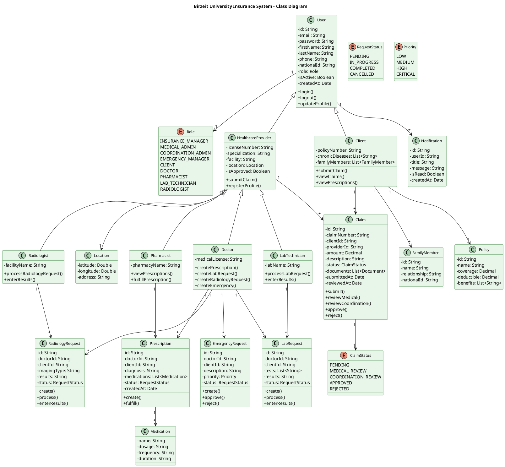

### 3.3.2 Sequence Diagram - Claims Workflow

**Figure 3: Claims Processing Sequence Diagram**

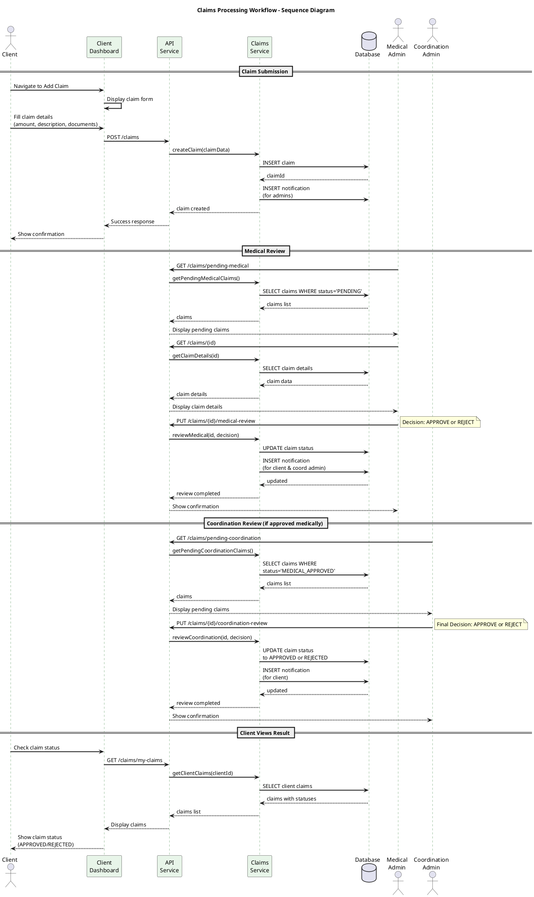

### 3.3.3 Sequence Diagram - Prescription Workflow

**Figure 4: Prescription Workflow Sequence Diagram**

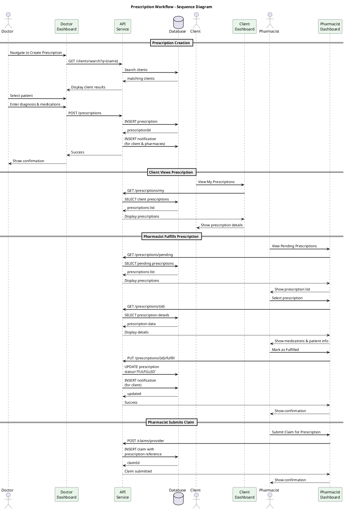

### 3.3.4 Activity Diagram - User Registration

**Figure 5: User Registration Activity Diagram**

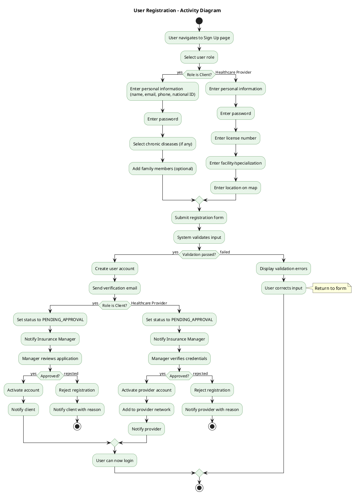

### 3.3.5 Activity Diagram - Claims Processing

**Figure 6: Claims Processing Activity Diagram**

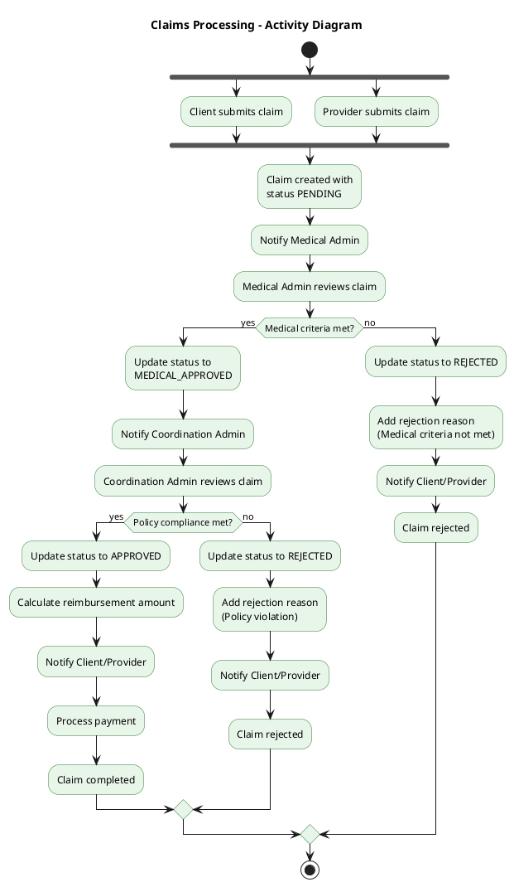

### 3.3.6 State Chart - Claim Status

**Figure 7: Claim State Chart**

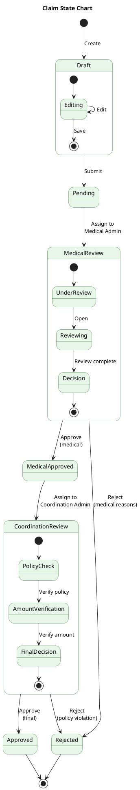

### 3.3.7 State Chart - Prescription Status

**Figure 8: Prescription State Chart**

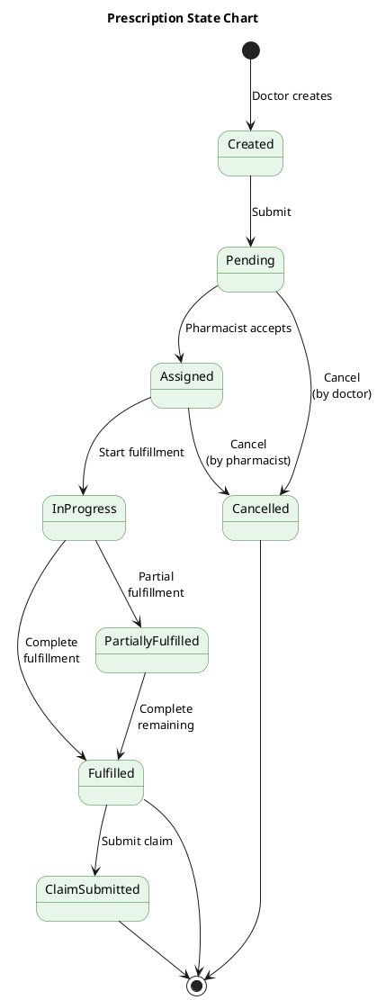

### 3.3.8 Component Architecture

The system follows a component-based architecture with the following structure:

```
src/
├── Component/
│   ├── Auth/                    # Authentication components
│   │   ├── SignIn.jsx
│   │   ├── SignUp.jsx
│   │   ├── ForgotPassword.jsx
│   │   ├── ResetPassword.jsx
│   │   ├── LandingPage.jsx
│   │   └── LogoutDialog.jsx
│   │
│   ├── Manager/                 # Insurance Manager components
│   │   ├── ManagerDashboard.jsx
│   │   ├── Sidebar.jsx
│   │   ├── Policies/
│   │   ├── Claims/
│   │   ├── Clients/
│   │   ├── Reports/
│   │   └── Notifications/
│   │
│   ├── Client/                  # Client components
│   │   ├── ClientDashboard.jsx
│   │   ├── ClientSidebar.jsx
│   │   ├── AddClaim.jsx
│   │   ├── MyClaims.jsx
│   │   ├── MyPrescriptions.jsx
│   │   ├── MyLabRequests.jsx
│   │   └── MyRadiologyRequests.jsx
│   │
│   ├── Doctor/                  # Doctor components
│   │   ├── DoctorDashboard.jsx
│   │   ├── DoctorSidebar.jsx
│   │   ├── AddPrescription.jsx
│   │   ├── AddLabRequest.jsx
│   │   ├── AddRadiologyRequest.jsx
│   │   └── AddEmergency.jsx
│   │
│   ├── Pharmacist/              # Pharmacist components
│   │   ├── PharmacistDashboard.jsx
│   │   ├── PharmacistSidebar.jsx
│   │   └── PrescriptionList.jsx
│   │
│   ├── Lab/                     # Lab Technician components
│   │   ├── LabDashboard.jsx
│   │   ├── LabSidebar.jsx
│   │   └── labrequestlist.jsx
│   │
│   ├── Radiology/               # Radiologist components
│   │   ├── RadiologyDashboard.jsx
│   │   ├── RadiologySidebar.jsx
│   │   └── RadiologyRequestList.jsx
│   │
│   ├── MedicalAdmin/            # Medical Administrator components
│   │   ├── MedicalAdminDashboard.jsx
│   │   ├── MedicalClaimsReview.jsx
│   │   └── MedicalDecisionsList.jsx
│   │
│   ├── CoordinationAdmin/       # Coordination Administrator components
│   │   ├── CoordinationDashboard.jsx
│   │   └── Claims/
│   │
│   ├── EmergencyManager/        # Emergency Manager components
│   │   ├── EmergencyDashboard.jsx
│   │   └── EmergencyNotifications.jsx
│   │
│   ├── Shared/                  # Shared components
│   │   ├── HealthcareProvidersMapOnly.jsx
│   │   ├── HealthcareProvidersFilter.jsx
│   │   └── SharedHealthcareProviderFormClaim.jsx
│   │
│   └── Profile/                 # Profile components
│       ├── Profile.jsx
│       ├── DoctorProfile.jsx
│       ├── PharmacistProfile.jsx
│       ├── LabProfile.jsx
│       └── RadiologyProfile.jsx
│
├── config/
│   ├── roles.js                 # Role-based access control configuration
│   ├── api.js                   # API endpoint definitions
│   ├── translations.js          # i18n translations
│   └── queryClient.js           # React Query configuration
│
├── utils/
│   ├── apiService.js            # HTTP client with interceptors
│   ├── sanitize.js              # XSS prevention
│   ├── validation.js            # Form validation
│   └── errorHandler.js          # Error processing
│
├── App.jsx                      # Main routing configuration
├── main.jsx                     # Application entry point
└── theme.js                     # Theme configuration
```

### 3.3.2 State Flow Diagram (Claims)

```
┌─────────────┐     Submit      ┌─────────────┐    Medical     ┌─────────────┐
│   DRAFT     │ ──────────────► │   PENDING   │ ──────────────►│  MEDICAL    │
│             │                 │             │    Review      │   REVIEW    │
└─────────────┘                 └─────────────┘                └──────┬──────┘
                                                                      │
                               ┌──────────────────────────────────────┤
                               │                                      │
                               ▼                                      ▼
                        ┌─────────────┐                        ┌─────────────┐
                        │  REJECTED   │                        │ COORDINATION│
                        │  (Medical)  │                        │   REVIEW    │
                        └─────────────┘                        └──────┬──────┘
                                                                      │
                               ┌──────────────────────────────────────┤
                               │                                      │
                               ▼                                      ▼
                        ┌─────────────┐                        ┌─────────────┐
                        │  REJECTED   │                        │  APPROVED   │
                        │(Coordination)│                        │             │
                        └─────────────┘                        └─────────────┘
```

## 3.4 System Architecture

### 3.4.1 Sub-Systems

| Subsystem | Description |
|-----------|-------------|
| **Authentication Module** | Handles user login, registration, password management, and session control |
| **Claims Management** | Manages claim submission, review workflows, approval/rejection, and tracking |
| **Medical Requests** | Handles prescriptions, lab requests, radiology requests, and emergency requests |
| **User Management** | Manages user profiles, role assignments, and permission control |
| **Healthcare Provider Network** | Maintains provider registry, search functionality, and map visualization |
| **Notifications** | Handles real-time notifications and alerts for all users |
| **Reporting** | Generates various reports for analysis and decision-making |
| **Internationalization** | Manages language switching and RTL support |

### 3.4.2 Software Architecture

The system follows a layered architecture:

#### Presentation Layer (React Components)
- Material-UI components for consistent design
- Role-specific dashboards and layouts
- Responsive design for all devices
- Lazy loading for performance optimization

#### State Management Layer
- React Query for server state (API data)
- React Context for client state (theme, language)
- Local storage for authentication tokens

#### Service Layer
- API service with Axios interceptors
- Error handling and retry logic
- Token management

#### External Integrations
- Leaflet maps for provider visualization
- WebSocket support for real-time updates (SockJS, StompJS)

### 3.4.3 Technology Stack

| Category | Technology | Purpose |
|----------|------------|---------|
| **Frontend Framework** | React 19.1.1 | Component-based UI development |
| **UI Library** | Material-UI 7.3.2 | Pre-built, accessible components |
| **Routing** | React Router 7.8.2 | Client-side navigation |
| **State Management** | React Query 5.90.16 | Server state with caching |
| **HTTP Client** | Axios 1.13.1 | API communication |
| **Maps** | Leaflet, React-Leaflet | Interactive maps |
| **Styling** | Tailwind CSS, Emotion | Utility-first and CSS-in-JS |
| **Build Tool** | Vite 7.1.2 | Fast development and builds |
| **Icons** | MUI Icons, Lucide React | Iconography |
| **Animation** | Framer Motion | Smooth transitions |
| **Charts** | Recharts | Data visualization |
| **Real-time** | SockJS, StompJS | WebSocket communication |

### 3.4.4 Component Diagram

**Figure 9: Component Diagram**

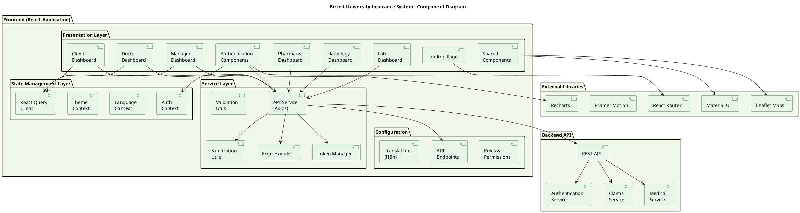

### 3.4.5 Deployment Diagram

**Figure 10: Deployment Diagram**

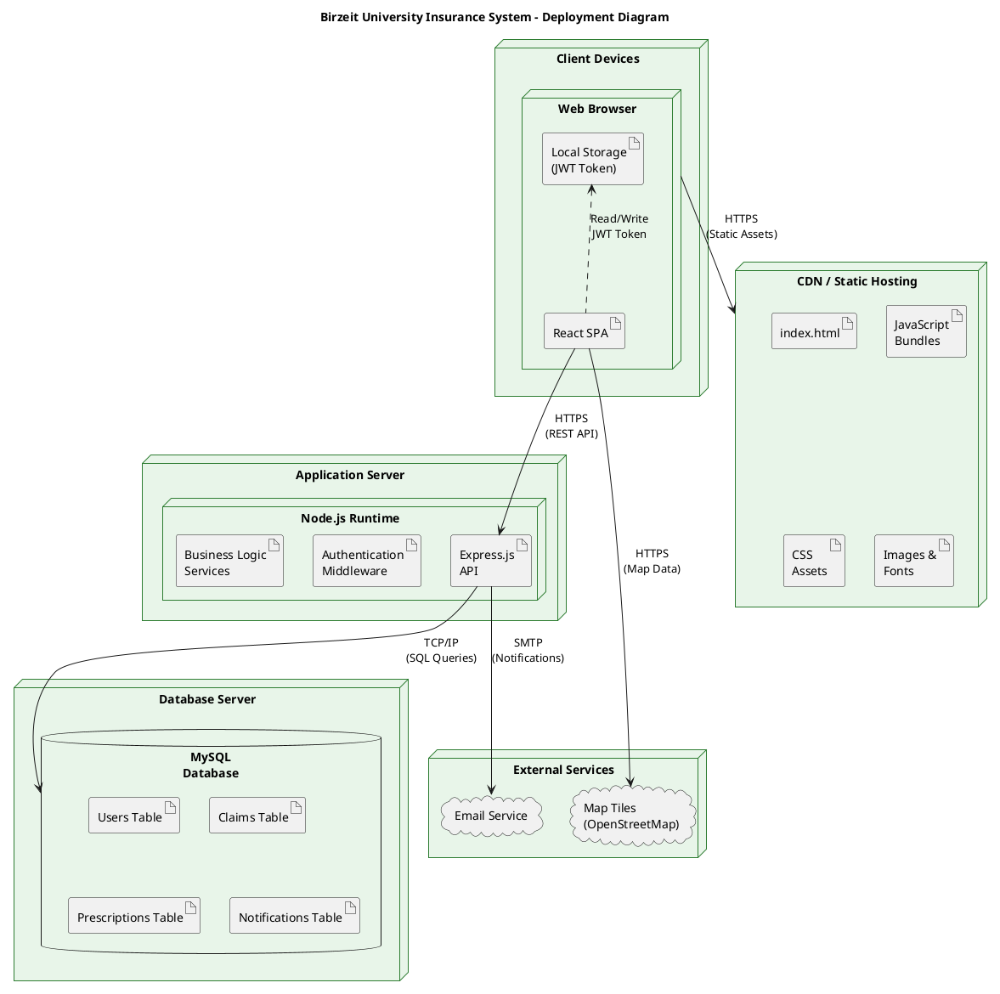

### 3.4.6 Entity Relationship Diagram

**Figure 11: ER Diagram**

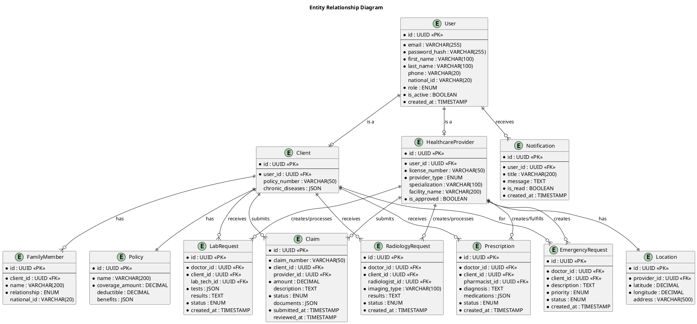

### 3.4.7 Data Flow Diagram (Context Level)

**Figure 12: Data Flow Diagram - Level 0**

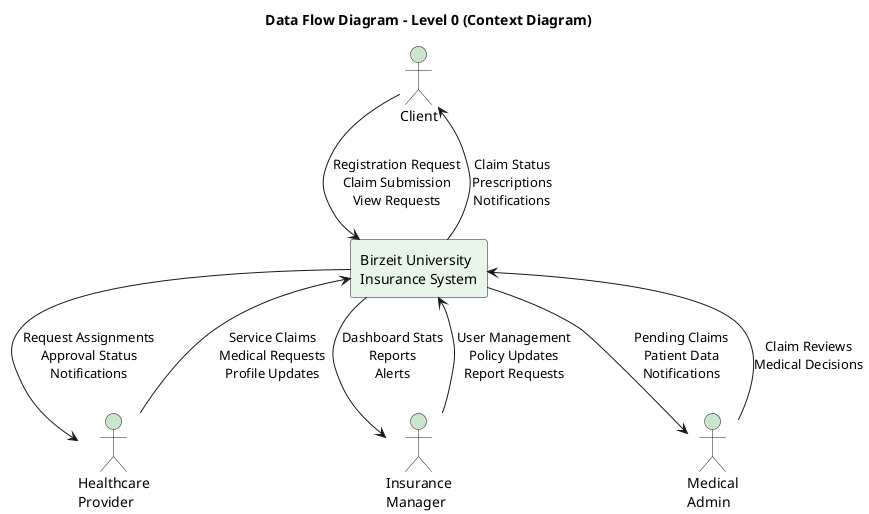

---

# Chapter 4: System Implementation

## 4.1 Introduction

This chapter provides a detailed technical account of the construction of the Birzeit University Insurance System frontend. It serves as a bridge between the conceptual design phase and the final, functional software product. The primary objective is to elucidate the engineering decisions, architectural patterns, and specific technologies employed.

Starting with the big picture, we'll look at the system's overall design and technology choices. Then, we'll explore the frontend implementation, covering its component structure, state management, and features like multi-language support and theming. Each section explains not just what we built, but also why, always keeping performance, scalability, and ease of maintenance in mind.

## 4.2 System Architecture and Technology Stack

### 4.2.1 Client-Server Architecture

The Birzeit University Insurance System operates on a client-server model. The React frontend runs entirely in the user's browser, communicating with the backend API via HTTP requests. The server processes requests, performs necessary operations, and returns responses in JSON format.

This decoupled architecture provides significant advantages:
- **Separation of Concerns**: Frontend and backend development can proceed independently
- **Scalability**: The frontend can be deployed to CDN for global distribution
- **Flexibility**: The same API can serve web, mobile, or other clients
- **Performance**: Client-side rendering reduces server load

### 4.2.2 Technology Selection Justification

| Technology | Selection Rationale |
|------------|---------------------|
| **React 19.1** | Latest version with improved performance, concurrent features, and large ecosystem |
| **Material-UI 7.3** | Comprehensive component library with accessibility, theming, and responsive design |
| **React Query 5.90** | Automatic caching, background refetching, optimistic updates, and devtools |
| **Vite 7.1** | Lightning-fast HMR, optimized builds, and modern ES module support |
| **Axios** | Request/response interceptors, automatic transforms, and wide browser support |
| **Leaflet** | Open-source, mobile-friendly maps with extensive plugin ecosystem |

## 4.3 Frontend Implementation

### 4.3.1 Application Entry Point (main.jsx)

The application initializes with a carefully ordered provider hierarchy:

```javascript
// Provider hierarchy in main.jsx
<React.StrictMode>
  <ErrorBoundary>
    <QueryClientProvider client={queryClient}>
      <LanguageProvider>
        <BrowserRouter>
          <ThemeProvider>
            <App />
          </ThemeProvider>
        </BrowserRouter>
      </LanguageProvider>
    </QueryClientProvider>
  </ErrorBoundary>
</React.StrictMode>
```

This structure ensures:
1. **Error Boundary**: Catches and handles React errors gracefully
2. **Query Client**: Provides React Query context for all components
3. **Language Provider**: Enables i18n throughout the application
4. **Browser Router**: Enables client-side routing
5. **Theme Provider**: Provides light/dark mode theming

### 4.3.2 Routing Configuration (App.jsx)

The routing system implements:

- **40+ Protected Routes**: All authenticated routes wrapped in PrivateRoute
- **Lazy Loading**: Components loaded on demand using React.lazy()
- **Code Splitting**: Automatic bundle splitting per route
- **Role-Based Redirects**: Automatic redirect to appropriate dashboard

```javascript
// Example lazy loaded route
const ManagerDashboard = lazy(() => import('./Component/Manager/ManagerDashboard'));

// Protected route wrapper
<Route path="/manager/dashboard" element={
  <PrivateRoute allowedRoles={['INSURANCE_MANAGER']}>
    <Suspense fallback={<PageLoader />}>
      <ManagerDashboard />
    </Suspense>
  </PrivateRoute>
} />
```

### 4.3.3 Role-Based Access Control (roles.js)

The RBAC system defines:

- **9 User Roles**: Manager, Client, Doctor, Pharmacist, Lab, Radiologist, Medical Admin, Coordination Admin, Emergency Manager
- **113+ Permissions**: Granular permissions for all system operations
- **Role Aliases**: Normalization for backend variations
- **Helper Functions**: `hasRole()`, `hasPermission()`, `canAccessRoute()`

```javascript
// Permission mapping example
export const PERMISSIONS = {
  CLAIM_SUBMIT_OWN: 'claim:submit:own',
  CLAIM_SUBMIT_AS_PROVIDER: 'claim:submit:provider',
  CLAIM_VIEW_OWN: 'claim:view:own',
  CLAIM_VIEW_ALL: 'claim:view:all',
  CLAIM_REVIEW_MEDICAL: 'claim:review:medical',
  CLAIM_REVIEW_COORDINATION: 'claim:review:coordination',
  CLAIM_APPROVE: 'claim:approve',
  CLAIM_REJECT: 'claim:reject',
  // ... 100+ more permissions
};
```

### 4.3.4 Component Architecture

Components are organized by feature/role with consistent patterns:

**Dashboard Components**: Each role has a dedicated dashboard displaying:
- Quick statistics (total claims, pending requests, etc.)
- Recent activity
- Quick action buttons
- Healthcare provider map (where applicable)

**Sidebar Components**: Role-specific navigation with:
- Menu items based on permissions
- Active state highlighting
- Collapsible sections

**Form Components**: Consistent form handling with:
- Material-UI form controls
- Validation rules
- Error display
- Loading states

### 4.3.5 Internationalization (i18n)

The system supports English and Arabic with:

- **Translation Files**: 1000+ translation keys in `translations.js`
- **RTL Support**: Automatic right-to-left layout for Arabic
- **Language Persistence**: User preference stored in localStorage
- **Dynamic Text Direction**: Document direction changes with language

```javascript
// Language context usage
const { language, setLanguage, t } = useLanguage();

// Translation usage
<Typography>{t('dashboard.welcome')}</Typography>
```

### 4.3.6 Theming

The theme system provides:

- **Light/Dark Modes**: User-selectable with persistence
- **Olive Green Healthcare Theme**: Custom primary color palette
- **Responsive Breakpoints**: Consistent across components
- **Component Overrides**: Customized Material-UI defaults

## 4.4 State Management and Data Fetching

### 4.4.1 React Query Implementation

React Query handles all server state with:

```javascript
// Query client configuration
const queryClient = new QueryClient({
  defaultOptions: {
    queries: {
      retry: 2,
      staleTime: 5 * 60 * 1000, // 5 minutes
      cacheTime: 30 * 60 * 1000, // 30 minutes
    },
  },
});

// Query usage example
const { data: claims, isLoading, error } = useQuery({
  queryKey: ['claims', userId],
  queryFn: () => fetchUserClaims(userId),
});
```

### 4.4.2 API Service Layer

The API service provides:

- **Axios Instance**: Configured with base URL and defaults
- **Request Interceptors**: Automatic token attachment
- **Response Interceptors**: Error handling and token refresh
- **Token Management**: Secure storage and retrieval

```javascript
// API service interceptor
api.interceptors.request.use((config) => {
  const token = getToken();
  if (token) {
    config.headers.Authorization = `Bearer ${token}`;
  }
  return config;
});
```

## 4.5 Security Implementation

### 4.5.1 Authentication

- **JWT Tokens**: Secure, stateless authentication
- **Token Storage**: localStorage with automatic attachment
- **Session Management**: Token expiration handling
- **Protected Routes**: PrivateRoute wrapper for all authenticated pages

### 4.5.2 Input Sanitization

- **XSS Prevention**: All user input sanitized before display
- **Form Validation**: Client-side validation before submission
- **Error Handling**: User-friendly error messages without sensitive data

### 4.5.3 Role-Based Security

- **Permission Checks**: UI elements hidden based on permissions
- **Route Guards**: Unauthorized access redirected appropriately
- **API Authorization**: Backend validates all requests

## 4.6 Application Screenshots

### 4.6.1 Landing Page
The public landing page features:
- Sign In and Sign Up tabs
- Feature showcase
- Team information
- Contact details
- Olive green healthcare theme

### 4.6.2 Manager Dashboard
The Insurance Manager dashboard displays:
- Total clients, policies, and pending claims statistics
- Healthcare provider network map
- Quick action buttons for common tasks
- Recent claims and notifications

### 4.6.3 Client Dashboard
The Client dashboard shows:
- Personal insurance status
- Active claims with status tracking
- Recent prescriptions and requests
- Healthcare provider search

### 4.6.4 Doctor Dashboard
The Doctor dashboard provides:
- Patient management interface
- Quick prescription creation
- Lab and radiology request forms
- Emergency request submission

### 4.6.5 Claims Management
The claims interface includes:
- Filterable claims list
- Status-based color coding
- Detailed claim view with documents
- Approval/rejection actions (for authorized users)

### 4.6.6 Healthcare Provider Map
The provider network map features:
- Interactive Leaflet map
- Provider type filtering
- Click-to-view provider details
- Location-based search

### 4.6.7 Prescription Management
Prescription interfaces include:
- Doctor: Creation form with medication selection
- Pharmacist: Pending prescription list with fulfill action
- Client: Personal prescription history

---

# Chapter 5: Testing

## 5.1 Testing Overview

Testing ensures the Birzeit University Insurance System functions correctly and meets quality standards. The testing approach covers functional testing of all features, usability testing for user experience, and security testing for data protection.

## 5.2 List of Features to be Tested

1. User Authentication (Sign In, Sign Up, Password Reset)
2. Role-Based Access Control
3. Claims Submission and Management
4. Prescription Creation and Fulfillment
5. Lab Request Processing
6. Radiology Request Processing
7. Emergency Request Handling
8. Healthcare Provider Search and Map
9. Notifications System
10. Profile Management
11. Report Generation
12. Language Switching (i18n)
13. Theme Switching (Light/Dark)
14. Responsive Design

## 5.3 Test Cases

### 5.3.1 User Login Test Case

| Field | Description |
|-------|-------------|
| **Test Case ID** | TC-001 |
| **Test Case Name** | User Login |
| **Objective** | Verify users can authenticate successfully |
| **Preconditions** | User has registered account |
| **Test Steps** | 1. Navigate to login page<br>2. Enter valid email<br>3. Enter valid password<br>4. Click Sign In button |
| **Expected Result** | User is authenticated and redirected to role-specific dashboard |
| **Actual Result** | Pass |

### 5.3.2 Role-Based Access Test Case

| Field | Description |
|-------|-------------|
| **Test Case ID** | TC-002 |
| **Test Case Name** | Role-Based Access Control |
| **Objective** | Verify users can only access permitted features |
| **Preconditions** | User is logged in with specific role |
| **Test Steps** | 1. Login as Client<br>2. Attempt to access Manager dashboard URL directly<br>3. Observe system response |
| **Expected Result** | User is redirected to their own dashboard or shown access denied |
| **Actual Result** | Pass |

### 5.3.3 Claim Submission Test Case

| Field | Description |
|-------|-------------|
| **Test Case ID** | TC-003 |
| **Test Case Name** | Client Claim Submission |
| **Objective** | Verify clients can submit claims successfully |
| **Preconditions** | Client is logged in |
| **Test Steps** | 1. Navigate to Add Claim page<br>2. Fill required fields (date, amount, description)<br>3. Attach supporting document<br>4. Click Submit |
| **Expected Result** | Claim is created with PENDING status and appears in claims list |
| **Actual Result** | Pass |

### 5.3.4 Prescription Creation Test Case

| Field | Description |
|-------|-------------|
| **Test Case ID** | TC-004 |
| **Test Case Name** | Doctor Prescription Creation |
| **Objective** | Verify doctors can create prescriptions |
| **Preconditions** | Doctor is logged in |
| **Test Steps** | 1. Navigate to Add Prescription<br>2. Search and select patient<br>3. Enter diagnosis<br>4. Add medications<br>5. Submit prescription |
| **Expected Result** | Prescription is created and visible to patient and pharmacies |
| **Actual Result** | Pass |

### 5.3.5 Healthcare Provider Search Test Case

| Field | Description |
|-------|-------------|
| **Test Case ID** | TC-005 |
| **Test Case Name** | Healthcare Provider Map Search |
| **Objective** | Verify users can search and view providers on map |
| **Preconditions** | User is logged in |
| **Test Steps** | 1. Navigate to Healthcare Providers<br>2. Select provider type filter (e.g., Pharmacy)<br>3. View map results<br>4. Click on a provider marker |
| **Expected Result** | Filtered providers appear on map, clicking shows provider details |
| **Actual Result** | Pass |

### 5.3.6 Language Switching Test Case

| Field | Description |
|-------|-------------|
| **Test Case ID** | TC-006 |
| **Test Case Name** | Language Toggle (EN/AR) |
| **Objective** | Verify language switching works correctly |
| **Preconditions** | User is on any page |
| **Test Steps** | 1. Click language toggle<br>2. Select Arabic<br>3. Observe UI changes |
| **Expected Result** | All text changes to Arabic, layout switches to RTL |
| **Actual Result** | Pass |

### 5.3.7 Theme Switching Test Case

| Field | Description |
|-------|-------------|
| **Test Case ID** | TC-007 |
| **Test Case Name** | Theme Toggle (Light/Dark) |
| **Objective** | Verify theme switching persists |
| **Preconditions** | User is logged in |
| **Test Steps** | 1. Click theme toggle<br>2. Switch to Dark mode<br>3. Refresh page |
| **Expected Result** | Dark theme is applied and persists after refresh |
| **Actual Result** | Pass |

### 5.3.8 Notifications Test Case

| Field | Description |
|-------|-------------|
| **Test Case ID** | TC-008 |
| **Test Case Name** | Notification Display |
| **Objective** | Verify notifications appear for relevant events |
| **Preconditions** | User has notifications |
| **Test Steps** | 1. Navigate to Notifications page<br>2. View notification list<br>3. Click on a notification |
| **Expected Result** | Notifications are displayed with correct content and timestamps |
| **Actual Result** | Pass |

### 5.3.9 Responsive Design Test Case

| Field | Description |
|-------|-------------|
| **Test Case ID** | TC-009 |
| **Test Case Name** | Mobile Responsiveness |
| **Objective** | Verify UI adapts to mobile screens |
| **Preconditions** | None |
| **Test Steps** | 1. Open application on mobile device/emulator<br>2. Navigate through main pages<br>3. Test form interactions |
| **Expected Result** | All elements are visible and usable on mobile screens |
| **Actual Result** | Pass |

### 5.3.10 Claims Workflow Test Case

| Field | Description |
|-------|-------------|
| **Test Case ID** | TC-010 |
| **Test Case Name** | Full Claims Approval Workflow |
| **Objective** | Verify complete claims workflow from submission to approval |
| **Preconditions** | Multiple user accounts (Client, Medical Admin, Coordination Admin) |
| **Test Steps** | 1. Client submits claim<br>2. Medical Admin reviews and approves<br>3. Coordination Admin reviews and approves<br>4. Client views approved claim |
| **Expected Result** | Claim status progresses correctly through all stages |
| **Actual Result** | Pass |

---

# References

1. React Documentation. (2025). React – A JavaScript library for building user interfaces. https://react.dev/

2. Material-UI Documentation. (2025). MUI: The React component library. https://mui.com/

3. React Query Documentation. (2025). TanStack Query - Powerful asynchronous state management. https://tanstack.com/query/

4. Vite Documentation. (2025). Vite - Next Generation Frontend Tooling. https://vitejs.dev/

5. React Router Documentation. (2025). React Router - Declarative routing for React. https://reactrouter.com/

6. Leaflet Documentation. (2025). Leaflet - An open-source JavaScript library for mobile-friendly interactive maps. https://leafletjs.com/

7. Axios Documentation. (2025). Axios - Promise based HTTP client. https://axios-http.com/

8. JWT.io. (2025). JSON Web Tokens. https://jwt.io/

9. OWASP Foundation. (2025). OWASP Top Ten Web Application Security Risks. https://owasp.org/www-project-top-ten/

10. Nielsen, J. (2023). Usability Engineering. Morgan Kaufmann Publishers.

11. Gamma, E., Helm, R., Johnson, R., & Vlissides, J. (1994). Design Patterns: Elements of Reusable Object-Oriented Software. Addison-Wesley.

12. Martin, R. C. (2017). Clean Architecture: A Craftsman's Guide to Software Structure and Design. Prentice Hall.

---

# Appendix A: System Requirements

## Hardware Requirements
- Computer with modern web browser
- Minimum 4GB RAM
- Stable internet connection

## Software Requirements
- Modern web browser (Chrome, Firefox, Edge, Safari)
- JavaScript enabled
- Cookies enabled for session management

---

# Appendix B: User Roles and Permissions Summary

| Role | Key Permissions |
|------|-----------------|
| **Insurance Manager** | Full system access, policy management, final claim approval |
| **Medical Administrator** | Medical claim review, chronic patient management, emergency handling |
| **Coordination Administrator** | Policy compliance review, claim coordination |
| **Emergency Manager** | Emergency request management and prioritization |
| **Client** | Submit own claims, view own records, track requests |
| **Doctor** | Create prescriptions, lab/radiology requests, submit provider claims |
| **Pharmacist** | View/fulfill prescriptions, submit provider claims |
| **Lab Technician** | Process lab requests, enter results, submit provider claims |
| **Radiologist** | Process radiology requests, enter results, submit provider claims |

---

*This report was prepared by the project team: Jadallah Baraghitha, Mousa Shuaib, and Osaid Hamayel, under the supervision of Dr. Samer Zein, Department of Computer Science, Birzeit University.*
